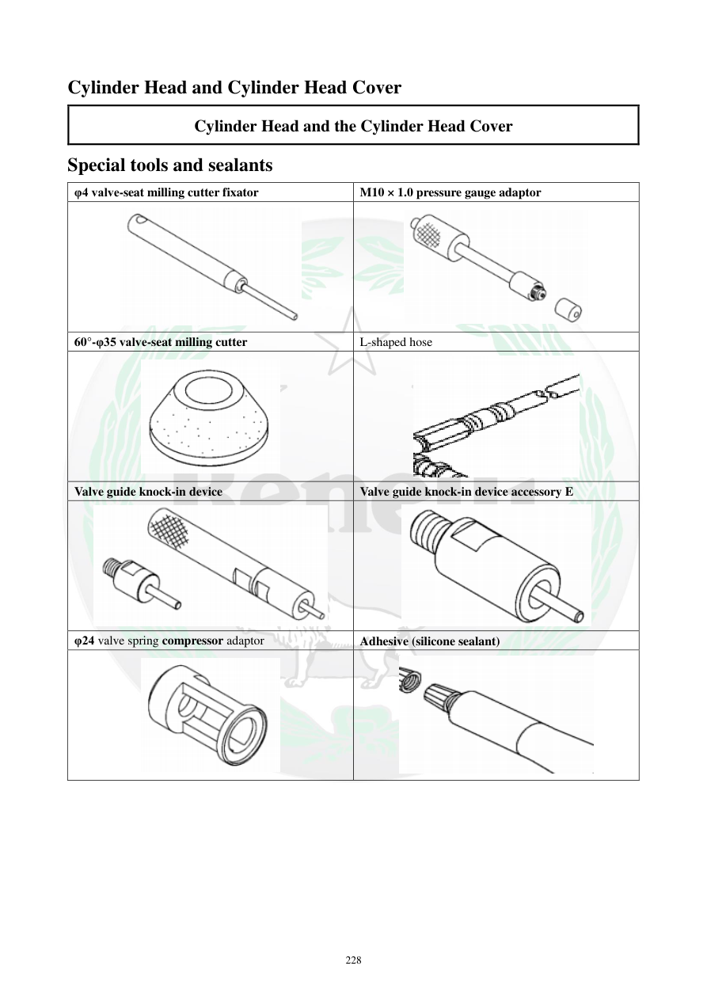

# Manual page 229

> Source: [page-0229.md](../source/page-0229.md)

## Page image / diagram

- [page-0229-img-01.png](../images/embedded/page-0229-img-01.png)

- [page-0229-img-02.png](../images/embedded/page-0229-img-02.png)

- [page-0229-img-03.png](../images/embedded/page-0229-img-03.png)

- [page-0229-img-04.png](../images/embedded/page-0229-img-04.png)

- [page-0229-img-05.png](../images/embedded/page-0229-img-05.png)

- [page-0229-img-06.png](../images/embedded/page-0229-img-06.png)

- [page-0229-img-07.png](../images/embedded/page-0229-img-07.png)

- [page-0229-img-08.png](../images/embedded/page-0229-img-08.png)

## Extracted text

# Source page 229

 
228 
Cylinder Head and Cylinder Head Cover 
Cylinder Head and the Cylinder Head Cover 
Special tools and sealants 
φ4 valve-seat milling cutter fixator 
M10 × 1.0 pressure gauge adaptor 
 
 
60°-φ35 valve-seat milling cutter 
L-shaped hose 
 
 
Valve guide knock-in device 
Valve guide knock-in device accessory E 
 
 
φ24 valve spring compressor adaptor 
Adhesive (silicone sealant)

## Persian notes

### ابزارهای مخصوص و مواد آب‌بندی
- ابزار تثبیت فرز نشیمن **φ4**.
- آداپتور گیج فشار **M10×1.0**.
- فرز نشیمن **60°-φ35** و شیلنگ L شکل.
- ابزار کوبش/نصب گاید سوپاپ و متعلقات آن.
- آداپتور فنرسوپاپ‌جمع‌کن **φ24**.
- ماده آب‌بندی: **Silicone sealant**.
