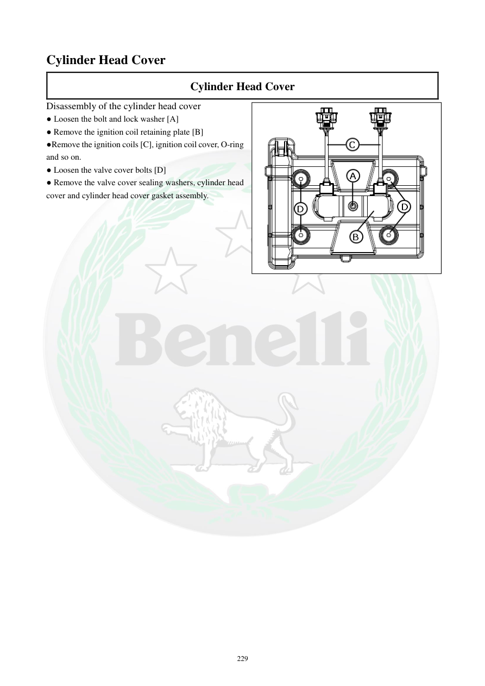

# Manual page 230

> Source: [page-0230.md](../source/page-0230.md)

## Page image / diagram

- [page-0230-img-01.png](../images/embedded/page-0230-img-01.png)

## Extracted text

# Source page 230

 
229 
Cylinder Head Cover 
Cylinder Head Cover 
Disassembly of the cylinder head cover 
● Loosen the bolt and lock washer [A] 
● Remove the ignition coil retaining plate [B] 
●Remove the ignition coils [C], ignition coil cover, O-ring 
and so on. 
● Loosen the valve cover bolts [D] 
● Remove the valve cover sealing washers, cylinder head 
cover and cylinder head cover gasket assembly.

## Persian notes

### بازکردن درپوش سرسیلندر
1. پیچ و واشر قفل‌کن **[A]** را شل کنید.
2. صفحه نگهدارنده کویل جرقه **[B]** را خارج کنید.
3. کویل‌های جرقه **[C]**، پوشش کویل، اورینگ و قطعات مربوط را خارج کنید.
4. پیچ‌های درپوش سوپاپ **[D]** را شل کنید.
5. واشرهای آب‌بندی پیچ‌های درپوش، خود درپوش سرسیلندر و مجموعه واشر درپوش را خارج کنید.
