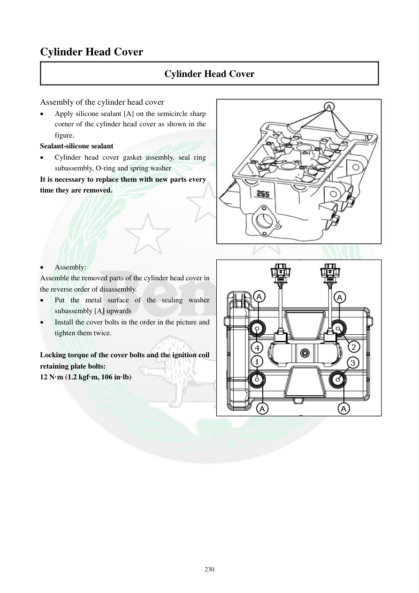

# Manual page 231

> Source: [page-0231.md](../source/page-0231.md)

## Page image / diagram

- [page-0231-img-01.jpeg](../images/embedded/page-0231-img-01.jpeg)

- [page-0231-img-02.png](../images/embedded/page-0231-img-02.png)

## Extracted text

# Source page 231

 
230 
Cylinder Head Cover 
 
Assembly of the cylinder head cover 
 
Apply silicone sealant [A] on the semicircle sharp 
corner of the cylinder head cover as shown in the 
figure, 
Sealant-silicone sealant 
 
Cylinder head cover gasket assembly, seal ring 
subassembly, O-ring and spring washer 
It is necessary to replace them with new parts every 
time they are removed. 
 
 
 
 
 
 
 
Assembly: 
Assemble the removed parts of the cylinder head cover in 
the reverse order of disassembly.  
 
Put the metal surface of the sealing washer 
subassembly [A] upwards  
 
Install the cover bolts in the order in the picture and 
tighten them twice. 
   
Locking torque of the cover bolts and the ignition coil 
retaining plate bolts: 
12 N·m (1.2 kgf·m, 106 in·lb) 
 
 
 
 
 
Cylinder Head Cover

## Persian notes

### مونتاژ درپوش سرسیلندر
- روی گوشه‌های نیم‌دایره‌ای تیز درپوش، طبق شکل، **Silicone sealant** بزنید.
- مجموعه واشر درپوش، مجموعه رینگ آب‌بندی، اورینگ و واشر فنری باید **هر بار پس از باز شدن با قطعه نو تعویض شوند**.
- قطعات را در ترتیب معکوس بازکردن نصب کنید.
- سطح فلزی مجموعه واشر آب‌بندی **[A] رو به بالا** قرار گیرد.
- پیچ‌های درپوش را طبق ترتیب نشان‌داده‌شده در تصویر و **در دو مرحله** سفت کنید.
- گشتاور پیچ‌های درپوش و پیچ‌های صفحه نگهدارنده کویل: **12 N·m = 1.2 kgf·m = 106 in·lb**.
