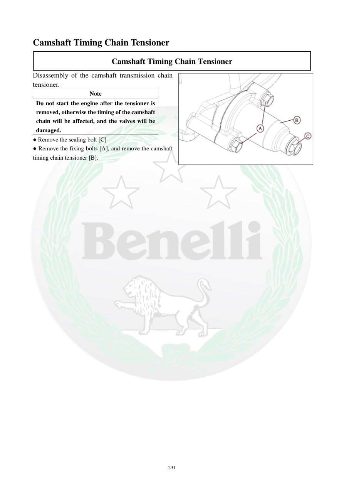

# Manual page 232

> Source: [page-0232.md](../source/page-0232.md)

## Page image / diagram

- [page-0232-img-01.png](../images/embedded/page-0232-img-01.png)

## Extracted text

# Source page 232

 
231 
Camshaft Timing Chain Tensioner  
Camshaft Timing Chain Tensioner 
Disassembly of the camshaft transmission chain 
tensioner. 
Note 
Do not start the engine after the tensioner is 
removed, otherwise the timing of the camshaft 
chain will be affected, and the valves will be 
damaged. 
● Remove the sealing bolt [C] 
● Remove the fixing bolts [A], and remove the camshaft 
timing chain tensioner [B].

## Persian notes

<!-- Persian translation/explanation will be added here. -->
