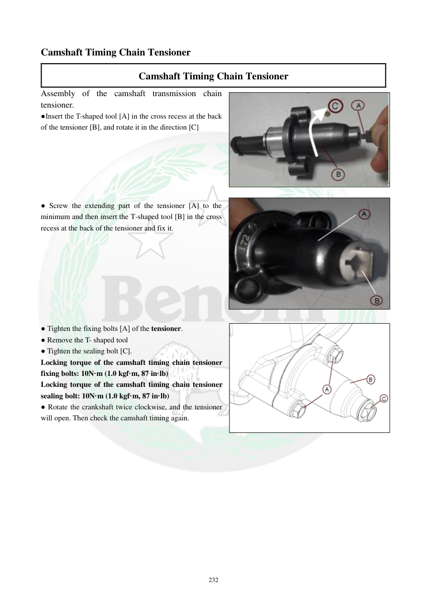

# Manual page 233

> Source: [page-0233.md](../source/page-0233.md)

## Page image / diagram

- [page-0233-img-01.jpeg](../images/embedded/page-0233-img-01.jpeg)

- [page-0233-img-02.png](../images/embedded/page-0233-img-02.png)

- [page-0233-img-03.jpeg](../images/embedded/page-0233-img-03.jpeg)

## Extracted text

# Source page 233

 
232 
Camshaft Timing Chain Tensioner 
Camshaft Timing Chain Tensioner 
Assembly of the camshaft transmission chain 
tensioner. 
●Insert the T-shaped tool [A] in the cross recess at the back 
of the tensioner [B], and rotate it in the direction [C]  
 
 
 
 
 
 
● Screw the extending part of the tensioner [A] to the 
minimum and then insert the T-shaped tool [B] in the cross 
recess at the back of the tensioner and fix it. 
 
 
 
 
 
 
 
 
● Tighten the fixing bolts [A] of the tensioner. 
● Remove the T- shaped tool 
● Tighten the sealing bolt [C]. 
Locking torque of the camshaft timing chain tensioner 
fixing bolts: 10N·m (1.0 kgf·m, 87 in·lb) 
Locking torque of the camshaft timing chain tensioner 
sealing bolt: 10N·m (1.0 kgf·m, 87 in·lb) 
● Rotate the crankshaft twice clockwise, and the tensioner 
will open. Then check the camshaft timing again.

## Persian notes

### نصب سفت‌کن زنجیر تایم
1. ابزار T شکل **[A]** را در شیار چهارگوش پشت سفت‌کن **[B]** قرار داده و در جهت مشخص‌شده بچرخانید.
2. قسمت متحرک سفت‌کن را تا حداقل مقدار جمع کنید، سپس ابزار T شکل را در شیار پشت آن قرار داده و ثابت کنید.
3. پیچ‌های نگهدارنده را سفت کنید، ابزار T شکل را خارج کنید و پیچ آب‌بندی **[C]** را ببندید.
4. گشتاور پیچ‌های نگهدارنده سفت‌کن: **10 N·m = 1.0 kgf·m = 87 in·lb**.
5. گشتاور پیچ آب‌بندی سفت‌کن: **10 N·m = 1.0 kgf·m = 87 in·lb**.
6. میل‌لنگ را **دو دور ساعت‌گرد** بچرخانید تا سفت‌کن باز شود، سپس تایم میل‌سوپاپ را دوباره کنترل کنید.
