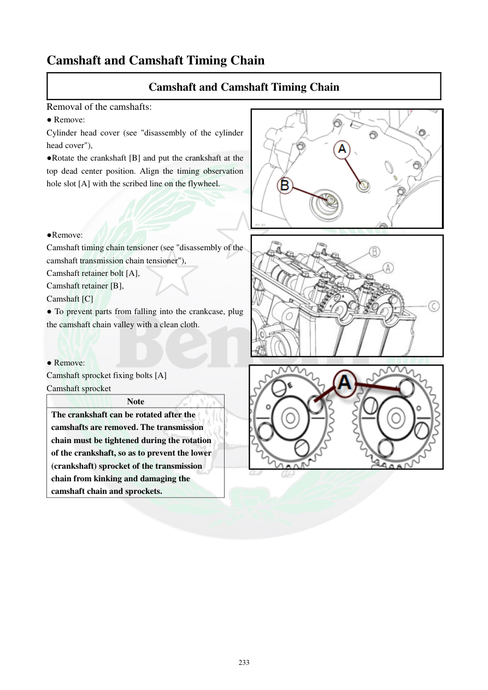

# Manual page 234

> Source: [page-0234.md](../source/page-0234.md)

## Page image / diagram

- [page-0234-img-01.png](../images/embedded/page-0234-img-01.png)

- [page-0234-img-02.jpeg](../images/embedded/page-0234-img-02.jpeg)

- [page-0234-img-03.png](../images/embedded/page-0234-img-03.png)

## Extracted text

# Source page 234

 
233 
Camshaft and Camshaft Timing Chain 
Camshaft and Camshaft Timing Chain 
Removal of the camshafts: 
● Remove: 
Cylinder head cover (see "disassembly of the cylinder 
head cover"), 
●Rotate the crankshaft [B] and put the crankshaft at the 
top dead center position. Align the timing observation 
hole slot [A] with the scribed line on the flywheel. 
 
 
 
●Remove: 
Camshaft timing chain tensioner (see "disassembly of the 
camshaft transmission chain tensioner"), 
Camshaft retainer bolt [A], 
Camshaft retainer [B], 
Camshaft [C] 
● To prevent parts from falling into the crankcase, plug 
the camshaft chain valley with a clean cloth. 
 
 
● Remove: 
Camshaft sprocket fixing bolts [A] 
Camshaft sprocket 
Note 
The crankshaft can be rotated after the 
camshafts are removed. The transmission 
chain must be tightened during the rotation 
of the crankshaft, so as to prevent the lower 
(crankshaft) sprocket of the transmission 
chain from kinking and damaging the 
camshaft chain and sprockets.

## Persian notes

### بازکردن میل‌سوپاپ‌ها
- ابتدا درپوش سرسیلندر را طبق بخش مربوط باز کنید.
- میل‌لنگ را بچرخانید تا پیستون در **نقطه مرگ بالا (TDC)** قرار گیرد. شیار سوراخ بازدید تایم **[A]** باید با خط حک‌شده روی فلایویل هم‌راستا شود.
- سفت‌کن زنجیر تایم را باز کنید.
- پیچ نگهدارنده میل‌سوپاپ **[A]**، نگهدارنده میل‌سوپاپ **[B]** و میل‌سوپاپ **[C]** را خارج کنید.
- برای جلوگیری از افتادن قطعات داخل کارتل/محفظه میل‌لنگ، مسیر زنجیر میل‌سوپاپ را با پارچه تمیز مسدود کنید.
- پیچ‌های چرخ‌دنده میل‌سوپاپ و سپس چرخ‌دنده را خارج کنید.
⚠️ پس از خارج شدن میل‌سوپاپ‌ها، چرخاندن میل‌لنگ فقط با **کشیده نگه داشتن زنجیر تایم** انجام شود تا زنجیر/چرخ‌دنده پایین میل‌لنگ کج یا تا نخورده و به زنجیر و چرخ‌دنده‌های تایم آسیب وارد نشود.
