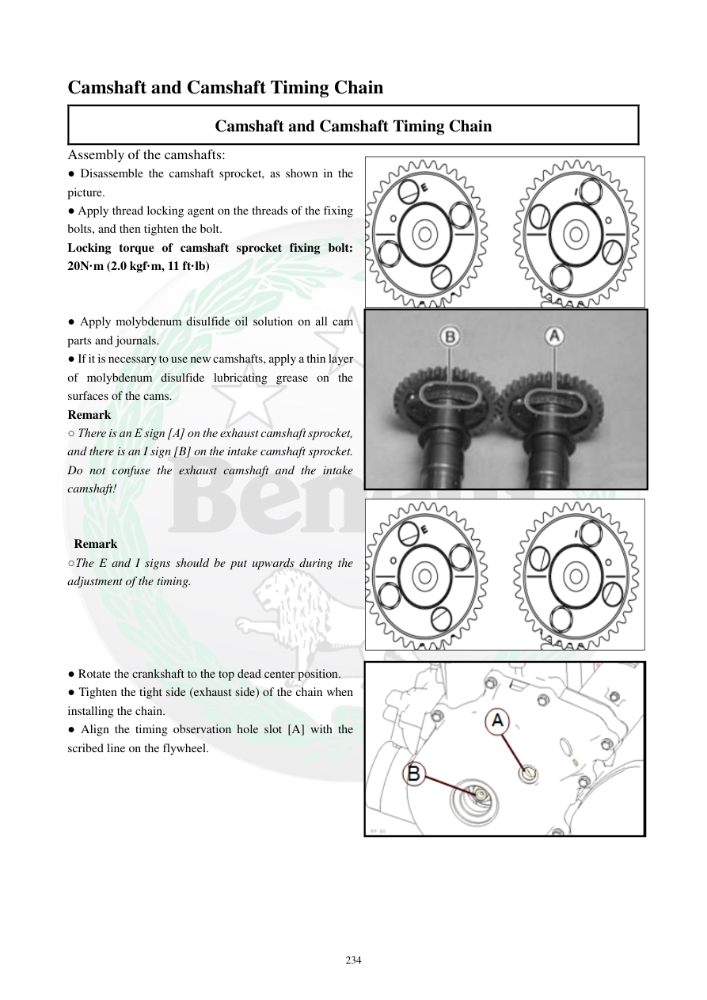

# Manual page 235

> Source: [page-0235.md](../source/page-0235.md)

## Page image / diagram

- [page-0235-img-02.png](../images/embedded/page-0235-img-02.png)

- [page-0235-img-03.jpeg](../images/embedded/page-0235-img-03.jpeg)

## Extracted text

# Source page 235

 
234 
Camshaft and Camshaft Timing Chain 
Camshaft and Camshaft Timing Chain 
Assembly of the camshafts: 
● Disassemble the camshaft sprocket, as shown in the 
picture. 
● Apply thread locking agent on the threads of the fixing 
bolts, and then tighten the bolt. 
Locking torque of camshaft sprocket fixing bolt: 
20N·m (2.0 kgf·m, 11 ft·lb) 
 
 
● Apply molybdenum disulfide oil solution on all cam 
parts and journals. 
● If it is necessary to use new camshafts, apply a thin layer 
of molybdenum disulfide lubricating grease on the 
surfaces of the cams. 
Remark 
○ There is an E sign [A] on the exhaust camshaft sprocket, 
and there is an I sign [B] on the intake camshaft sprocket. 
Do not confuse the exhaust camshaft and the intake 
camshaft! 
 
 
 Remark 
○The E and I signs should be put upwards during the 
adjustment of the timing. 
 
 
 
 
● Rotate the crankshaft to the top dead center position. 
● Tighten the tight side (exhaust side) of the chain when 
installing the chain. 
● Align the timing observation hole slot [A] with the 
scribed line on the flywheel.

## Persian notes

### نصب میل‌سوپاپ و تنظیم اولیه تایم
- چرخ‌دنده میل‌سوپاپ را طبق تصویر مونتاژ کنید و روی رزوه پیچ‌های آن **Thread locker** بزنید.
- گشتاور پیچ چرخ‌دنده میل‌سوپاپ: **20 N·m = 2.0 kgf·m**. متن انگلیسی معادل **11 ft·lb** را ذکر کرده که از نظر تبدیل با 20 N·m سازگار نیست؛ بنابراین عدد **20 N·m** مرجع اصلی این جدول است و مورد اختلاف باید با تصویر/نسخه اصلی کنترل شود.
- روی تمام بادامک‌ها و ژورنال‌ها محلول روغنی حاوی **مولیبدن دی‌سولفید** بزنید.
- اگر میل‌سوپاپ نو نصب می‌شود، سطح بادامک‌ها یک لایه نازک گریس مولیبدن‌دار دریافت کند.
- میل‌سوپاپ اگزوز علامت **E** و میل‌سوپاپ ورودی علامت **I** دارد؛ آنها را جابه‌جا نکنید.
- هنگام تنظیم تایم، علامت‌های **E و I باید رو به بالا** باشند.
- میل‌لنگ را روی TDC قرار دهید و سمت کشیده زنجیر، یعنی **سمت اگزوز**، هنگام نصب زنجیر کشیده باشد.
- شیار سوراخ بازدید تایم را با خط فلایویل هم‌راستا کنید.
