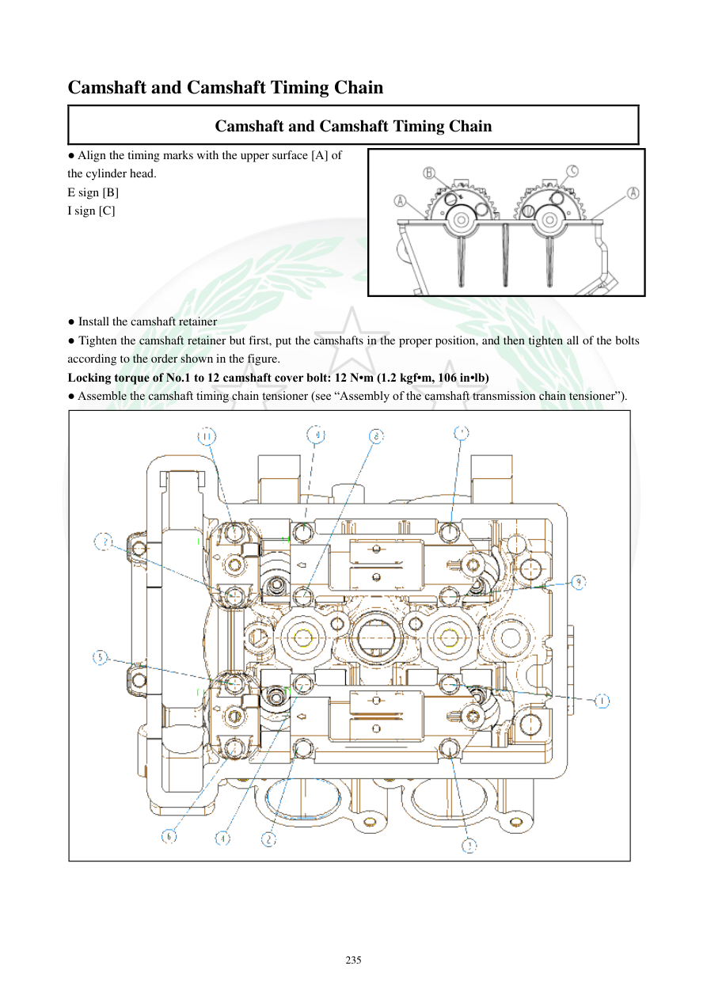

# Manual page 236

> Source: [page-0236.md](../source/page-0236.md)

## Page image / diagram

- [page-0236-img-01.png](../images/embedded/page-0236-img-01.png)

- [page-0236-img-02.png](../images/embedded/page-0236-img-02.png)

## Extracted text

# Source page 236

 
235 
Camshaft and Camshaft Timing Chain 
Camshaft and Camshaft Timing Chain 
● Align the timing marks with the upper surface [A] of 
the cylinder head. 
E sign [B] 
I sign [C] 
 
 
 
 
 
● Install the camshaft retainer 
● Tighten the camshaft retainer but first, put the camshafts in the proper position, and then tighten all of the bolts 
according to the order shown in the figure. 
Locking torque of No.1 to 12 camshaft cover bolt: 12 N•m (1.2 kgf•m, 106 in•lb) 
● Assemble the camshaft timing chain tensioner (see “Assembly of the camshaft transmission chain tensioner”).

## Persian notes

### تنظیم علامت‌های تایم و بستن نگهدارنده میل‌سوپاپ
- علامت‌های تایم را با سطح بالایی سرسیلندر هم‌راستا کنید: **E = اگزوز** و **I = ورودی**.
- نگهدارنده میل‌سوپاپ را نصب کنید.
- قبل از سفت کردن، میل‌سوپاپ‌ها را در موقعیت صحیح قرار دهید و تمام پیچ‌ها را طبق **ترتیب نشان‌داده‌شده در تصویر** سفت کنید.
- گشتاور پیچ‌های شماره **1 تا 12** نگهدارنده/کاور میل‌سوپاپ: **12 N·m = 1.2 kgf·m = 106 in·lb**.
- سپس سفت‌کن زنجیر تایم را طبق روش صفحه 233 نصب کنید.
