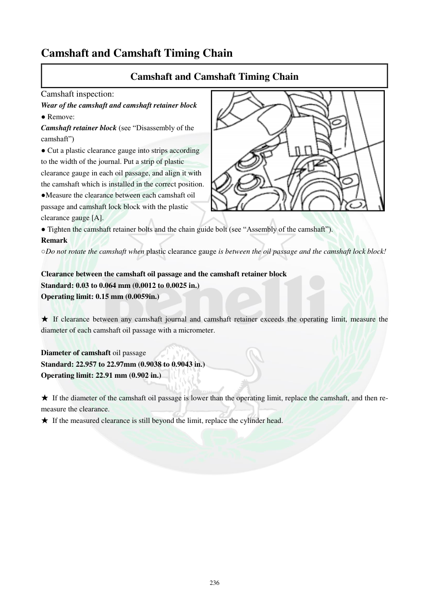

# Manual page 237

> Source: [page-0237.md](../source/page-0237.md)

## Page image / diagram

- [page-0237-img-01.png](../images/embedded/page-0237-img-01.png)

## Extracted text

# Source page 237

 
236 
Camshaft and Camshaft Timing Chain 
Camshaft and Camshaft Timing Chain 
Camshaft inspection: 
Wear of the camshaft and camshaft retainer block 
● Remove: 
Camshaft retainer block (see “Disassembly of the 
camshaft”) 
● Cut a plastic clearance gauge into strips according 
to the width of the journal. Put a strip of plastic 
clearance gauge in each oil passage, and align it with 
the camshaft which is installed in the correct position. 
●Measure the clearance between each camshaft oil 
passage and camshaft lock block with the plastic 
clearance gauge [A]. 
● Tighten the camshaft retainer bolts and the chain guide bolt (see “Assembly of the camshaft”). 
Remark 
○Do not rotate the camshaft when plastic clearance gauge is between the oil passage and the camshaft lock block! 
 
Clearance between the camshaft oil passage and the camshaft retainer block 
Standard: 0.03 to 0.064 mm (0.0012 to 0.0025 in.) 
Operating limit: 0.15 mm (0.0059in.) 
 
★ If clearance between any camshaft journal and camshaft retainer exceeds the operating limit, measure the 
diameter of each camshaft oil passage with a micrometer. 
 
Diameter of camshaft oil passage 
Standard: 22.957 to 22.97mm (0.9038 to 0.9043 in.) 
Operating limit: 22.91 mm (0.902 in.) 
 
★ If the diameter of the camshaft oil passage is lower than the operating limit, replace the camshaft, and then re-
measure the clearance. 
★ If the measured clearance is still beyond the limit, replace the cylinder head.

## Persian notes

<!-- Persian translation/explanation will be added here. -->
