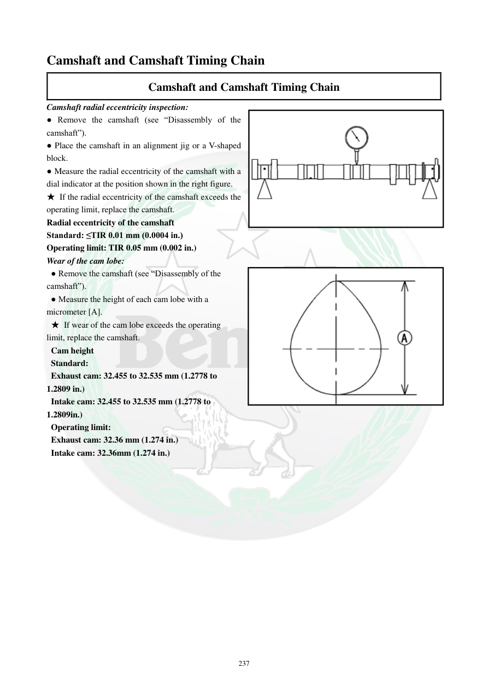

# Manual page 238

> Source: [page-0238.md](../source/page-0238.md)

## Page image / diagram

- [page-0238-img-01.png](../images/embedded/page-0238-img-01.png)

- [page-0238-img-02.png](../images/embedded/page-0238-img-02.png)

## Extracted text

# Source page 238

 
237 
Camshaft and Camshaft Timing Chain 
Camshaft and Camshaft Timing Chain 
Camshaft radial eccentricity inspection: 
● Remove the camshaft (see “Disassembly of the 
camshaft”). 
● Place the camshaft in an alignment jig or a V-shaped 
block. 
● Measure the radial eccentricity of the camshaft with a 
dial indicator at the position shown in the right figure. 
★ If the radial eccentricity of the camshaft exceeds the 
operating limit, replace the camshaft. 
Radial eccentricity of the camshaft  
Standard: ≤TIR 0.01 mm (0.0004 in.) 
Operating limit: TIR 0.05 mm (0.002 in.) 
Wear of the cam lobe:  
 ● Remove the camshaft (see “Disassembly of the 
camshaft”). 
 ● Measure the height of each cam lobe with a 
micrometer [A]. 
 ★ If wear of the cam lobe exceeds the operating 
limit, replace the camshaft. 
 Cam height 
 Standard: 
 Exhaust cam: 32.455 to 32.535 mm (1.2778 to 
1.2809 in.) 
 Intake cam: 32.455 to 32.535 mm (1.2778 to 
1.2809in.) 
 Operating limit: 
 Exhaust cam: 32.36 mm (1.274 in.) 
 Intake cam: 32.36mm (1.274 in.)

## Persian notes

<!-- Persian translation/explanation will be added here. -->
