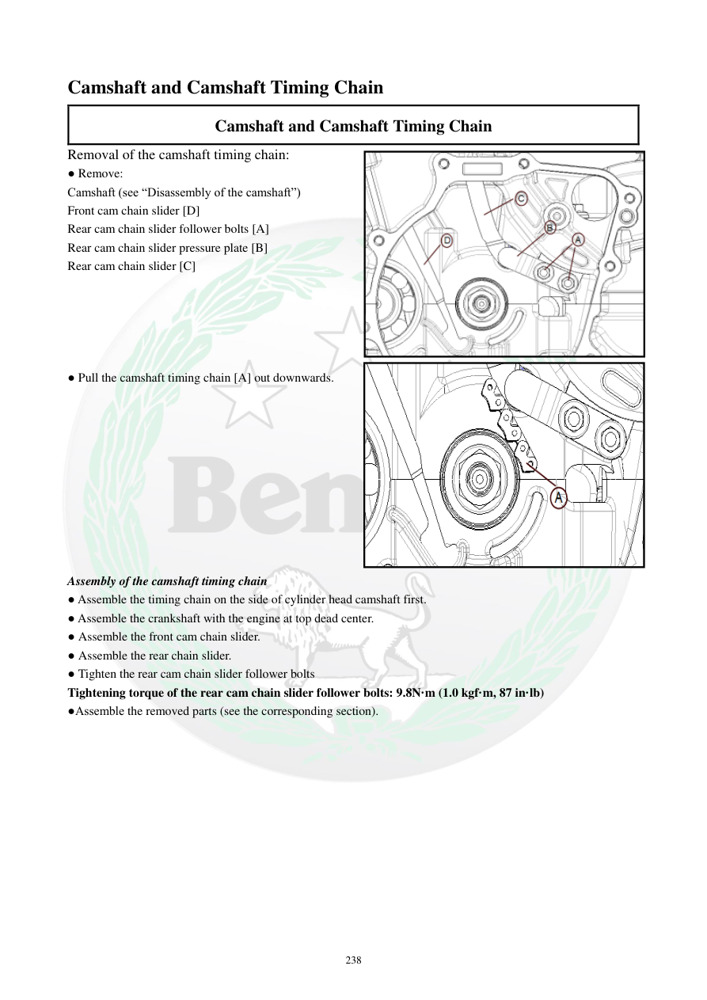

# Manual page 239

> Source: [page-0239.md](../source/page-0239.md)

## Page image / diagram

- [page-0239-img-01.png](../images/embedded/page-0239-img-01.png)

- [page-0239-img-02.png](../images/embedded/page-0239-img-02.png)

## Extracted text

# Source page 239

 
238 
Camshaft and Camshaft Timing Chain 
Camshaft and Camshaft Timing Chain 
Removal of the camshaft timing chain: 
● Remove: 
Camshaft (see “Disassembly of the camshaft”) 
Front cam chain slider [D] 
Rear cam chain slider follower bolts [A] 
Rear cam chain slider pressure plate [B] 
Rear cam chain slider [C] 
 
 
 
 
 
● Pull the camshaft timing chain [A] out downwards. 
 
 
 
 
 
 
 
 
 
 
Assembly of the camshaft timing chain 
● Assemble the timing chain on the side of cylinder head camshaft first. 
● Assemble the crankshaft with the engine at top dead center. 
● Assemble the front cam chain slider. 
● Assemble the rear chain slider. 
● Tighten the rear cam chain slider follower bolts  
Tightening torque of the rear cam chain slider follower bolts: 9.8N·m (1.0 kgf·m, 87 in·lb) 
●Assemble the removed parts (see the corresponding section).

## Persian notes

### باز و بست زنجیر تایم میل‌سوپاپ
**بازکردن:** پس از خارج کردن میل‌سوپاپ، لغزنده جلویی زنجیر، پیچ‌های دنبال‌کننده لغزنده عقب، صفحه فشار لغزنده عقب و خود لغزنده عقب خارج می‌شوند؛ سپس زنجیر تایم از پایین بیرون کشیده می‌شود.

**مونتاژ:**
1. ابتدا زنجیر تایم را در سمت سرسیلندر/میل‌سوپاپ قرار دهید.
2. میل‌لنگ را در **TDC** قرار دهید.
3. لغزنده جلویی و سپس لغزنده عقب را نصب کنید.
4. گشتاور پیچ‌های دنبال‌کننده لغزنده عقب: **9.8 N·m = 1.0 kgf·m = 87 in·lb**.
5. سایر قطعات طبق بخش مربوطه نصب شوند.
