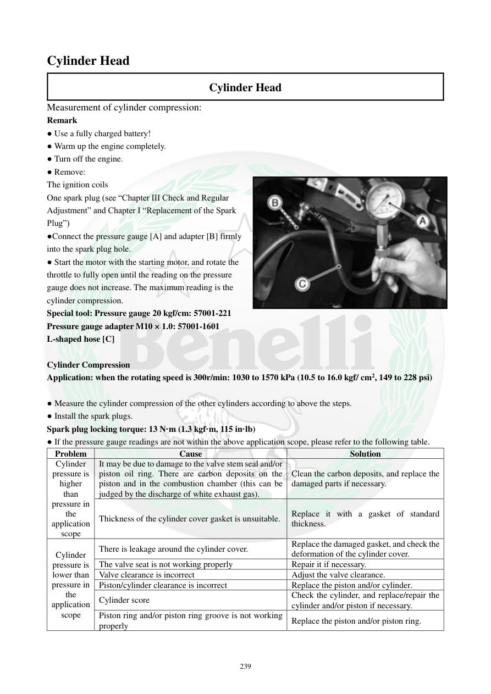

# Manual page 240

> Source: [page-0240.md](../source/page-0240.md)

## Page image / diagram

- [page-0240-img-01.jpeg](../images/embedded/page-0240-img-01.jpeg)

## Extracted text

# Source page 240

 
239 
Cylinder Head  
Cylinder Head   
Measurement of cylinder compression:  
Remark 
● Use a fully charged battery! 
● Warm up the engine completely. 
● Turn off the engine. 
● Remove: 
The ignition coils 
One spark plug (see “Chapter III Check and Regular 
Adjustment” and Chapter I “Replacement of the Spark 
Plug”) 
●Connect the pressure gauge [A] and adapter [B] firmly 
into the spark plug hole. 
● Start the motor with the starting motor, and rotate the 
throttle to fully open until the reading on the pressure 
gauge does not increase. The maximum reading is the 
cylinder compression. 
Special tool: Pressure gauge 20 kgf/cm: 57001-221 
Pressure gauge adapter M10 × 1.0: 57001-1601 
L-shaped hose [C] 
 
Cylinder Compression 
Application: when the rotating speed is 300r/min: 1030 to 1570 kPa (10.5 to 16.0 kgf/ cm2, 149 to 228 psi) 
 
● Measure the cylinder compression of the other cylinders according to above the steps. 
● Install the spark plugs. 
Spark plug locking torque: 13 N·m (1.3 kgf·m, 115 in·lb) 
● If the pressure gauge readings are not within the above application scope, please refer to the following table. 
Problem  
Cause 
Solution 
Cylinder 
pressure is 
higher 
than 
pressure in 
the 
application 
scope 
It may be due to damage to the valve stem seal and/or 
piston oil ring. There are carbon deposits on the 
piston and in the combustion chamber (this can be 
judged by the discharge of white exhaust gas). 
Clean the carbon deposits, and replace the 
damaged parts if necessary. 
Thickness of the cylinder cover gasket is unsuitable. 
Replace it with a gasket of standard 
thickness. 
Cylinder 
pressure is 
lower than 
pressure in 
the 
application 
scope 
There is leakage around the cylinder cover. 
Replace the damaged gasket, and check the 
deformation of the cylinder cover. 
The valve seat is not working properly 
Repair it if necessary. 
Valve clearance is incorrect 
Adjust the valve clearance. 
Piston/cylinder clearance is incorrect 
Replace the piston and/or cylinder. 
Cylinder score 
Check the cylinder, and replace/repair the 
cylinder and/or piston if necessary. 
Piston ring and/or piston ring groove is not working 
properly 
Replace the piston and/or piston ring.

## Persian notes

<!-- Persian translation/explanation will be added here. -->
