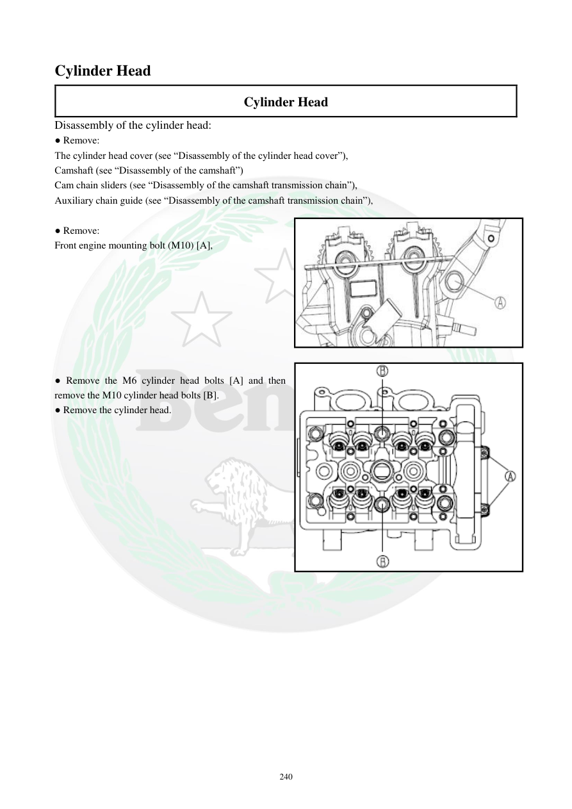

# Manual page 241

> Source: [page-0241.md](../source/page-0241.md)

## Page image / diagram

- [page-0241-img-01.jpeg](../images/embedded/page-0241-img-01.jpeg)

- [page-0241-img-02.png](../images/embedded/page-0241-img-02.png)

## Extracted text

# Source page 241

 
240 
Cylinder Head  
Cylinder Head 
Disassembly of the cylinder head: 
● Remove: 
The cylinder head cover (see “Disassembly of the cylinder head cover”), 
Camshaft (see “Disassembly of the camshaft”) 
Cam chain sliders (see “Disassembly of the camshaft transmission chain”), 
Auxiliary chain guide (see “Disassembly of the camshaft transmission chain”), 
 
● Remove: 
Front engine mounting bolt (M10) [A], 
 
 
 
 
 
 
 
 
● Remove the M6 cylinder head bolts [A] and then 
remove the M10 cylinder head bolts [B]. 
● Remove the cylinder head.

## Persian notes

<!-- Persian translation/explanation will be added here. -->
