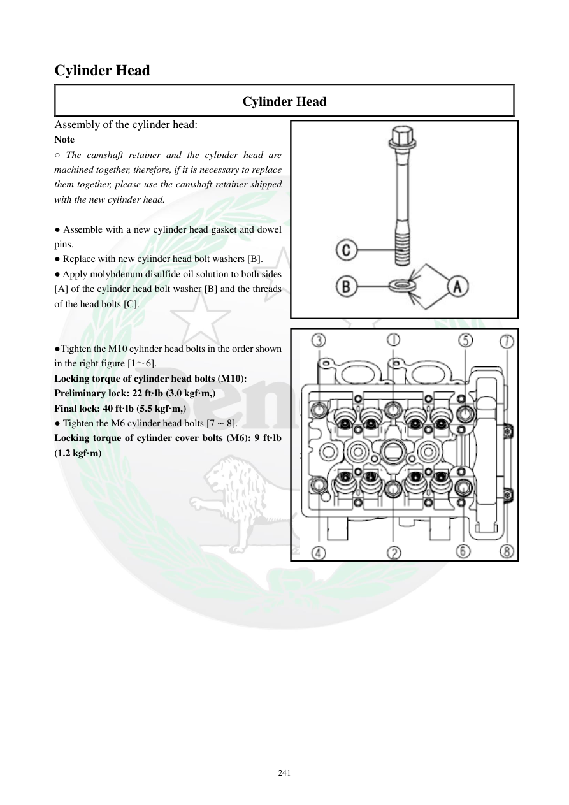

# Manual page 242

> Source: [page-0242.md](../source/page-0242.md)

## Page image / diagram

- [page-0242-img-01.png](../images/embedded/page-0242-img-01.png)

- [page-0242-img-02.jpeg](../images/embedded/page-0242-img-02.jpeg)

## Extracted text

# Source page 242

 
241 
Cylinder Head  
Cylinder Head 
Assembly of the cylinder head: 
Note 
○ The camshaft retainer and the cylinder head are 
machined together, therefore, if it is necessary to replace 
them together, please use the camshaft retainer shipped 
with the new cylinder head. 
 
● Assemble with a new cylinder head gasket and dowel 
pins. 
● Replace with new cylinder head bolt washers [B]. 
● Apply molybdenum disulfide oil solution to both sides 
[A] of the cylinder head bolt washer [B] and the threads 
of the head bolts [C]. 
 
 
●Tighten the M10 cylinder head bolts in the order shown 
in the right figure [1～6]. 
Locking torque of cylinder head bolts (M10): 
Preliminary lock: 22 ft·lb (3.0 kgf·m,) 
Final lock: 40 ft·lb (5.5 kgf·m,) 
● Tighten the M6 cylinder head bolts [7 ∼ 8]. 
Locking torque of cylinder cover bolts (M6): 9 ft·lb 
(1.2 kgf·m)

## Persian notes

<!-- Persian translation/explanation will be added here. -->
