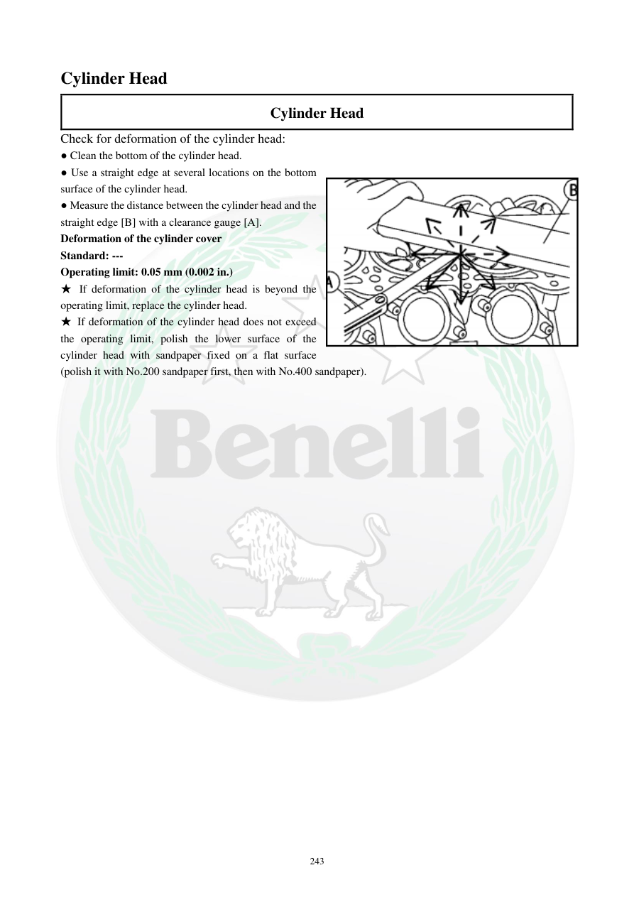

# Manual page 244

> Source: [page-0244.md](../source/page-0244.md)

## Page image / diagram

- [page-0244-img-01.png](../images/embedded/page-0244-img-01.png)

## Extracted text

# Source page 244

 
243 
Cylinder Head 
Cylinder Head 
Check for deformation of the cylinder head: 
● Clean the bottom of the cylinder head. 
● Use a straight edge at several locations on the bottom 
surface of the cylinder head. 
● Measure the distance between the cylinder head and the 
straight edge [B] with a clearance gauge [A]. 
Deformation of the cylinder cover 
Standard: --- 
Operating limit: 0.05 mm (0.002 in.) 
★ If deformation of the cylinder head is beyond the 
operating limit, replace the cylinder head. 
★ If deformation of the cylinder head does not exceed 
the operating limit, polish the lower surface of the 
cylinder head with sandpaper fixed on a flat surface 
(polish it with No.200 sandpaper first, then with No.400 sandpaper).

## Persian notes

### بررسی تاب سرسیلندر
- سطح زیر سرسیلندر را کاملاً تمیز کنید.
- خط‌کش صافی را در چند نقطه روی سطح زیرین قرار دهید.
- فاصله بین سرسیلندر و خط‌کش را با فیلر اندازه بگیرید.
- حد سرویس تاب: **0.05 mm (0.002 in.)**. مقدار استاندارد در دفترچه «---» درج شده است.
- اگر تاب بیشتر از **0.05 mm** باشد، سرسیلندر تعویض شود.
- اگر از حد بیشتر نباشد، دفترچه پرداخت سطح را با سنباده روی سطح کاملاً صاف توصیه می‌کند: ابتدا **No.200** و سپس **No.400**.
