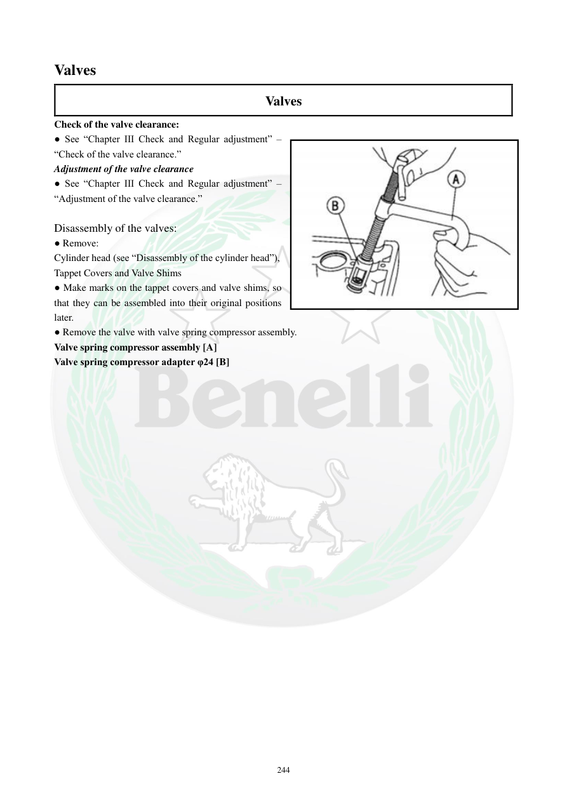

# Manual page 245

> Source: [page-0245.md](../source/page-0245.md)

## Page image / diagram

- [page-0245-img-01.jpeg](../images/embedded/page-0245-img-01.jpeg)

## Extracted text

# Source page 245

 
244 
Valves 
Valves 
Check of the valve clearance: 
● See “Chapter III Check and Regular adjustment” – 
“Check of the valve clearance.” 
Adjustment of the valve clearance 
● See “Chapter III Check and Regular adjustment” – 
“Adjustment of the valve clearance.” 
 
Disassembly of the valves: 
● Remove: 
Cylinder head (see “Disassembly of the cylinder head”), 
Tappet Covers and Valve Shims 
● Make marks on the tappet covers and valve shims, so 
that they can be assembled into their original positions 
later. 
● Remove the valve with valve spring compressor assembly. 
Valve spring compressor assembly [A] 
Valve spring compressor adapter φ24 [B]

## Persian notes

### بازکردن سوپاپ‌ها
- کنترل و تنظیم لقی سوپاپ طبق فصل III انجام می‌شود.
- برای بازکردن سوپاپ، ابتدا سرسیلندر را خارج کنید.
- کاپ‌های تایپت و شیم‌های سوپاپ را خارج کنید و روی آنها علامت بزنید تا بعداً در **موقعیت اصلی خودشان** نصب شوند.
- مجموعه سوپاپ را با فنرسوپاپ‌جمع‌کن خارج کنید.
- آداپتور فنرسوپاپ‌جمع‌کن: **φ24**.
