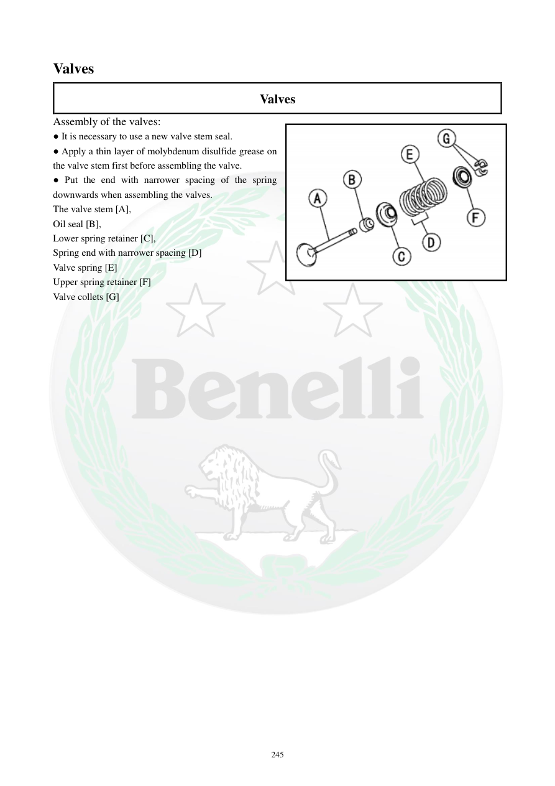

# Manual page 246

> Source: [page-0246.md](../source/page-0246.md)

## Page image / diagram

- [page-0246-img-01.png](../images/embedded/page-0246-img-01.png)

## Extracted text

# Source page 246

 
245 
Valves 
Valves 
Assembly of the valves: 
● It is necessary to use a new valve stem seal. 
● Apply a thin layer of molybdenum disulfide grease on 
the valve stem first before assembling the valve. 
● Put the end with narrower spacing of the spring 
downwards when assembling the valves. 
The valve stem [A], 
Oil seal [B], 
Lower spring retainer [C], 
Spring end with narrower spacing [D] 
Valve spring [E] 
Upper spring retainer [F] 
Valve collets [G]

## Persian notes

### مونتاژ سوپاپ
- **کاسه‌نمد ساق سوپاپ باید نو باشد.**
- قبل از نصب سوپاپ، یک لایه نازک گریس حاوی **مولیبدن دی‌سولفید** روی ساق سوپاپ بزنید.
- انتهای فنر با **فاصله حلقه‌های کمتر** باید هنگام نصب رو به پایین باشد.
- ترتیب قطعات: ساق سوپاپ **[A]**، کاسه‌نمد روغن **[B]**، نشیمن پایینی فنر **[C]**، سمت با فاصله کمتر فنر **[D]**، فنر سوپاپ **[E]**، نشیمن بالایی **[F]** و خارهای سوپاپ **[G]**.
