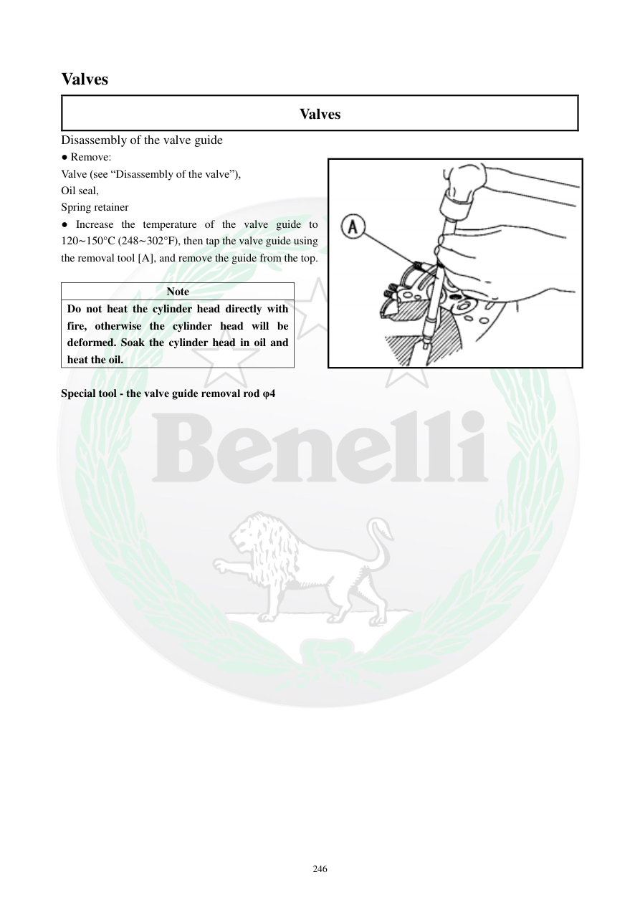

# Manual page 247

> Source: [page-0247.md](../source/page-0247.md)

## Page image / diagram

- [page-0247-img-01.png](../images/embedded/page-0247-img-01.png)

## Extracted text

# Source page 247

 
246 
Valves 
Valves 
Disassembly of the valve guide 
● Remove: 
Valve (see “Disassembly of the valve”), 
Oil seal, 
Spring retainer 
● Increase the temperature of the valve guide to 
120∼150°C (248∼302°F), then tap the valve guide using 
the removal tool [A], and remove the guide from the top. 
 
Note 
Do not heat the cylinder head directly with 
fire, otherwise the cylinder head will be 
deformed. Soak the cylinder head in oil and 
heat the oil. 
 
Special tool - the valve guide removal rod φ4

## Persian notes

### خارج کردن گاید سوپاپ
- ابتدا سوپاپ، کاسه‌نمد و نشیمن فنر را خارج کنید.
- دمای سرسیلندر/مجموعه را به **120–150°C (248–302°F)** برسانید، سپس با ابزار خارج‌کننده **[A]** گاید را از سمت بالا خارج کنید.
- ⚠️ سرسیلندر را **مستقیماً با شعله حرارت ندهید**؛ دفترچه هشدار می‌دهد این کار می‌تواند باعث تغییر شکل سرسیلندر شود.
- روش ذکرشده: سرسیلندر را در روغن قرار داده و روغن را گرم کنید.
- ابزار مخصوص: میله خارج‌کننده گاید سوپاپ **φ4**.
