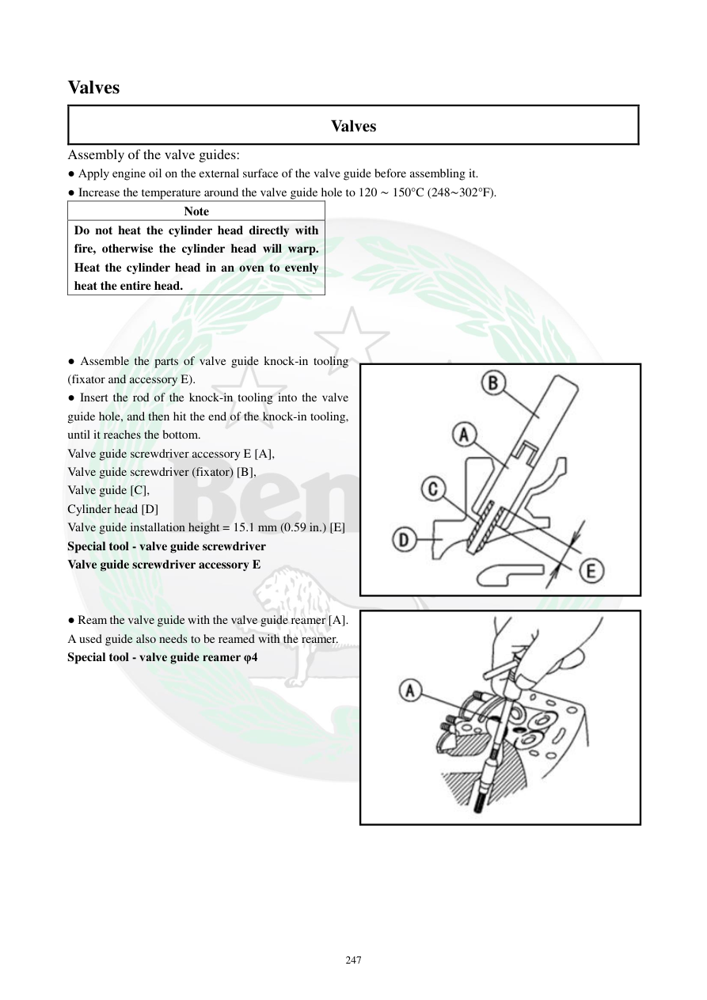

# Manual page 248

> Source: [page-0248.md](../source/page-0248.md)

## Page image / diagram

- [page-0248-img-01.jpeg](../images/embedded/page-0248-img-01.jpeg)

- [page-0248-img-02.jpeg](../images/embedded/page-0248-img-02.jpeg)

## Extracted text

# Source page 248

 
247 
Valves  
Valves 
Assembly of the valve guides: 
● Apply engine oil on the external surface of the valve guide before assembling it. 
● Increase the temperature around the valve guide hole to 120 ∼ 150°C (248∼302°F). 
Note 
Do not heat the cylinder head directly with 
fire, otherwise the cylinder head will warp. 
Heat the cylinder head in an oven to evenly 
heat the entire head. 
 
 
 
● Assemble the parts of valve guide knock-in tooling 
(fixator and accessory E). 
● Insert the rod of the knock-in tooling into the valve 
guide hole, and then hit the end of the knock-in tooling, 
until it reaches the bottom. 
Valve guide screwdriver accessory E [A], 
Valve guide screwdriver (fixator) [B], 
Valve guide [C], 
Cylinder head [D] 
Valve guide installation height = 15.1 mm (0.59 in.) [E] 
Special tool - valve guide screwdriver 
Valve guide screwdriver accessory E 
 
 
● Ream the valve guide with the valve guide reamer [A]. 
A used guide also needs to be reamed with the reamer. 
Special tool - valve guide reamer φ4

## Persian notes

<!-- Persian translation/explanation will be added here. -->
