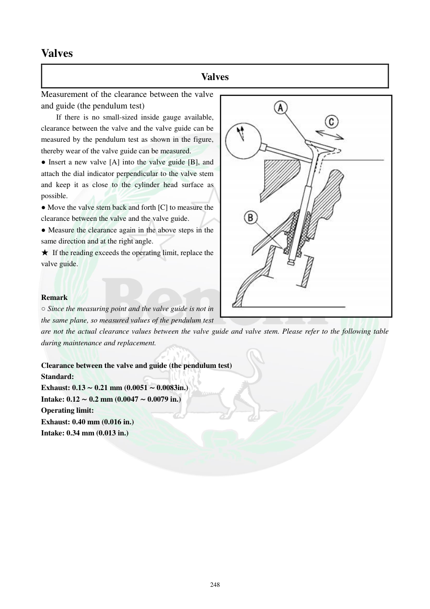

# Manual page 249

> Source: [page-0249.md](../source/page-0249.md)

## Page image / diagram

- [page-0249-img-01.jpeg](../images/embedded/page-0249-img-01.jpeg)

## Extracted text

# Source page 249

 
248 
Valves  
Valves  
Measurement of the clearance between the valve 
and guide (the pendulum test)  
If there is no small-sized inside gauge available, 
clearance between the valve and the valve guide can be 
measured by the pendulum test as shown in the figure, 
thereby wear of the valve guide can be measured. 
● Insert a new valve [A] into the valve guide [B], and 
attach the dial indicator perpendicular to the valve stem 
and keep it as close to the cylinder head surface as 
possible. 
● Move the valve stem back and forth [C] to measure the 
clearance between the valve and the valve guide. 
● Measure the clearance again in the above steps in the 
same direction and at the right angle. 
★ If the reading exceeds the operating limit, replace the 
valve guide. 
 
 
Remark 
○ Since the measuring point and the valve guide is not in 
the same plane, so measured values of the pendulum test 
are not the actual clearance values between the valve guide and valve stem. Please refer to the following table 
during maintenance and replacement. 
 
Clearance between the valve and guide (the pendulum test) 
Standard: 
Exhaust: 0.13 ∼ 0.21 mm (0.0051 ∼ 0.0083in.) 
Intake: 0.12 ∼ 0.2 mm (0.0047 ∼ 0.0079 in.) 
Operating limit: 
Exhaust: 0.40 mm (0.016 in.) 
Intake: 0.34 mm (0.013 in.)

## Persian notes

<!-- Persian translation/explanation will be added here. -->
