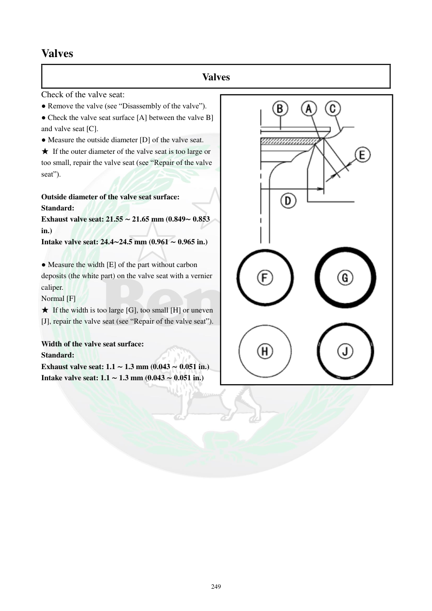

# Manual page 250

> Source: [page-0250.md](../source/page-0250.md)

## Page image / diagram

- [page-0250-img-01.png](../images/embedded/page-0250-img-01.png)

## Extracted text

# Source page 250

 
249 
Valves  
Valves 
Check of the valve seat: 
● Remove the valve (see “Disassembly of the valve”). 
● Check the valve seat surface [A] between the valve B] 
and valve seat [C]. 
● Measure the outside diameter [D] of the valve seat. 
★ If the outer diameter of the valve seat is too large or 
too small, repair the valve seat (see “Repair of the valve 
seat”). 
 
Outside diameter of the valve seat surface: 
Standard: 
Exhaust valve seat: 21.55 ∼ 21.65 mm (0.849∼ 0.853 
in.) 
Intake valve seat: 24.4∼24.5 mm (0.961 ∼ 0.965 in.) 
 
● Measure the width [E] of the part without carbon 
deposits (the white part) on the valve seat with a vernier 
caliper. 
Normal [F] 
★ If the width is too large [G], too small [H] or uneven 
[J], repair the valve seat (see “Repair of the valve seat”). 
 
Width of the valve seat surface: 
Standard: 
Exhaust valve seat: 1.1 ∼ 1.3 mm (0.043 ∼ 0.051 in.) 
Intake valve seat: 1.1 ∼ 1.3 mm (0.043 ∼ 0.051 in.)

## Persian notes

<!-- Persian translation/explanation will be added here. -->
