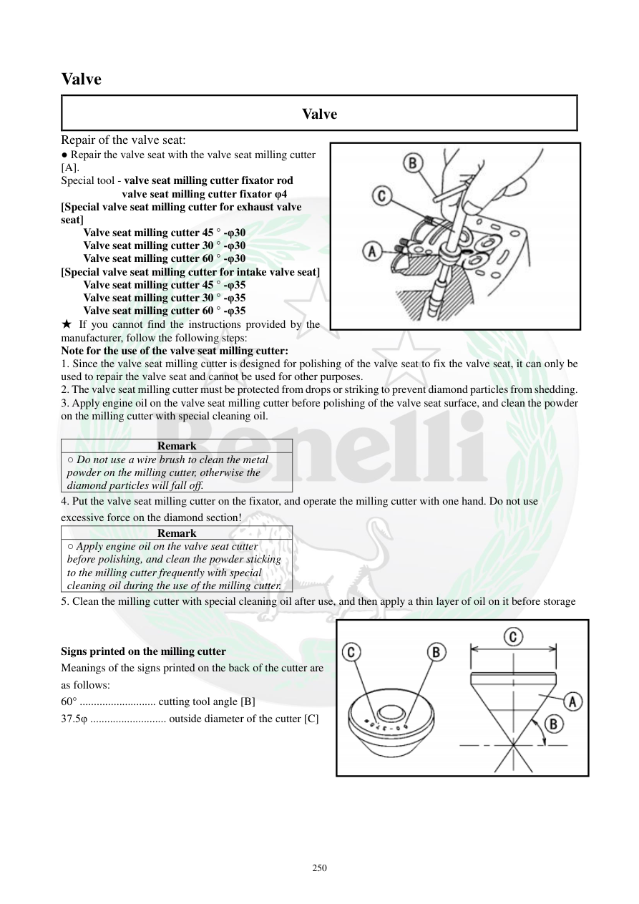

# Manual page 251

> Source: [page-0251.md](../source/page-0251.md)

## Page image / diagram

- [page-0251-img-01.jpeg](../images/embedded/page-0251-img-01.jpeg)

- [page-0251-img-02.png](../images/embedded/page-0251-img-02.png)

## Extracted text

# Source page 251

 
250 
Valve  
Valve 
Repair of the valve seat: 
● Repair the valve seat with the valve seat milling cutter 
[A]. 
Special tool - valve seat milling cutter fixator rod 
valve seat milling cutter fixator φ4 
[Special valve seat milling cutter for exhaust valve 
seat] 
Valve seat milling cutter 45 ° -φ30 
Valve seat milling cutter 30 ° -φ30 
Valve seat milling cutter 60 ° -φ30 
[Special valve seat milling cutter for intake valve seat] 
Valve seat milling cutter 45 ° -φ35 
Valve seat milling cutter 30 ° -φ35 
Valve seat milling cutter 60 ° -φ35 
★ If you cannot find the instructions provided by the 
manufacturer, follow the following steps: 
Note for the use of the valve seat milling cutter: 
1. Since the valve seat milling cutter is designed for polishing of the valve seat to fix the valve seat, it can only be 
used to repair the valve seat and cannot be used for other purposes. 
2. The valve seat milling cutter must be protected from drops or striking to prevent diamond particles from shedding. 
3. Apply engine oil on the valve seat milling cutter before polishing of the valve seat surface, and clean the powder 
on the milling cutter with special cleaning oil. 
 
Remark 
○ Do not use a wire brush to clean the metal 
powder on the milling cutter, otherwise the 
diamond particles will fall off.  
4. Put the valve seat milling cutter on the fixator, and operate the milling cutter with one hand. Do not use 
excessive force on the diamond section! 
Remark 
○ Apply engine oil on the valve seat cutter 
before polishing, and clean the powder sticking 
to the milling cutter frequently with special 
cleaning oil during the use of the milling cutter. 
5. Clean the milling cutter with special cleaning oil after use, and then apply a thin layer of oil on it before storage 
 
 
Signs printed on the milling cutter 
Meanings of the signs printed on the back of the cutter are 
as follows: 
60° ........................... cutting tool angle [B] 
37.5φ ........................... outside diameter of the cutter [C]

## Persian notes

### تعمیر سیت سوپاپ و کار با فرز سیت
- تعمیر سیت با فرز مخصوص و میله/فیکسچر **φ4** انجام می‌شود.
- فرزهای سیت اگزوز: **45°-φ30، 30°-φ30، 60°-φ30**.
- فرزهای سیت ورودی: **45°-φ35، 30°-φ35، 60°-φ35**.
- فرز سیت فقط برای تعمیر سیت طراحی شده و برای کار دیگر استفاده نشود.
- از افتادن یا ضربه خوردن فرز جلوگیری کنید تا ذرات الماس جدا نشوند.
- قبل از کار روی سیت، روی فرز **روغن موتور** بزنید و پودر حاصل را با روغن تمیزکننده مخصوص پاک کنید.
- ⚠️ برای پاک‌کردن پودر فلزی از **برس سیمی استفاده نکنید**؛ ممکن است ذرات الماس جدا شوند.
- هنگام کار فشار بیش از حد به بخش الماسی وارد نکنید.
- بعد از کار، فرز با روغن تمیزکننده مخصوص تمیز و برای نگهداری با لایه نازکی از روغن پوشانده شود.
- علامت پشت فرز، زاویه برش و قطر خارجی ابزار را مشخص می‌کند، مانند **60°** و **37.5φ**.
