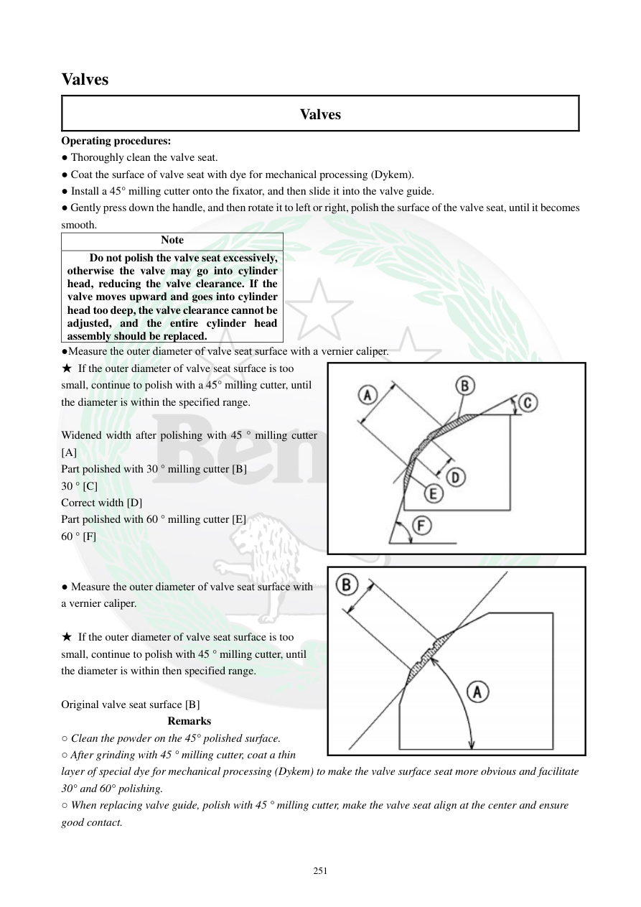

# Manual page 252

> Source: [page-0252.md](../source/page-0252.md)

## Page image / diagram

- [page-0252-img-01.png](../images/embedded/page-0252-img-01.png)

- [page-0252-img-02.jpeg](../images/embedded/page-0252-img-02.jpeg)

## Extracted text

# Source page 252

 
251 
Valves  
Valves  
Operating procedures:  
● Thoroughly clean the valve seat. 
● Coat the surface of valve seat with dye for mechanical processing (Dykem).  
● Install a 45° milling cutter onto the fixator, and then slide it into the valve guide.  
● Gently press down the handle, and then rotate it to left or right, polish the surface of the valve seat, until it becomes 
smooth.  
Note  
Do not polish the valve seat excessively, 
otherwise the valve may go into cylinder 
head, reducing the valve clearance. If the 
valve moves upward and goes into cylinder 
head too deep, the valve clearance cannot be 
adjusted, and the entire cylinder head 
assembly should be replaced.  
●Measure the outer diameter of valve seat surface with a vernier caliper.  
★ If the outer diameter of valve seat surface is too 
small, continue to polish with a 45° milling cutter, until 
the diameter is within the specified range.  
 
Widened width after polishing with 45 ° milling cutter 
[A] 
Part polished with 30 ° milling cutter [B] 
30 ° [C] 
Correct width [D] 
Part polished with 60 ° milling cutter [E] 
60 ° [F] 
 
 
● Measure the outer diameter of valve seat surface with 
a vernier caliper.  
 
★ If the outer diameter of valve seat surface is too 
small, continue to polish with 45 ° milling cutter, until 
the diameter is within then specified range.  
 
Original valve seat surface [B] 
Remarks  
○ Clean the powder on the 45° polished surface.  
○ After grinding with 45 ° milling cutter, coat a thin 
layer of special dye for mechanical processing (Dykem) to make the valve surface seat more obvious and facilitate 
30° and 60° polishing.  
○ When replacing valve guide, polish with 45 ° milling cutter, make the valve seat align at the center and ensure 
good contact.

## Persian notes

<!-- Persian translation/explanation will be added here. -->
