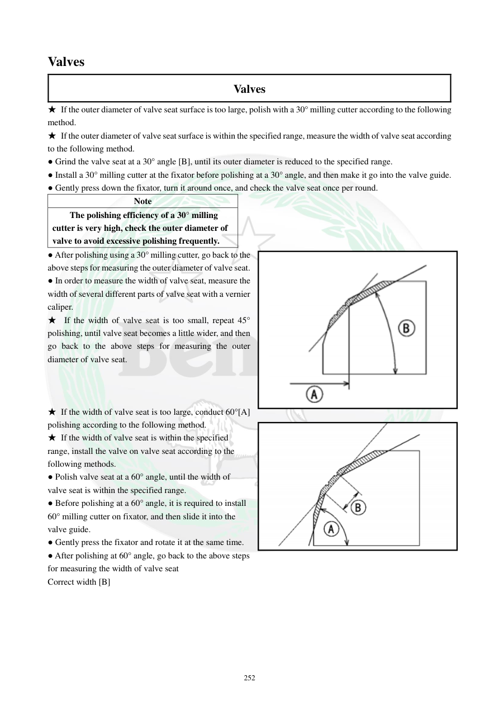

# Manual page 253

> Source: [page-0253.md](../source/page-0253.md)

## Page image / diagram

- [page-0253-img-01.png](../images/embedded/page-0253-img-01.png)

- [page-0253-img-02.png](../images/embedded/page-0253-img-02.png)

## Extracted text

# Source page 253

 
252 
Valves  
Valves 
★ If the outer diameter of valve seat surface is too large, polish with a 30° milling cutter according to the following 
method.  
★ If the outer diameter of valve seat surface is within the specified range, measure the width of valve seat according 
to the following method.  
● Grind the valve seat at a 30° angle [B], until its outer diameter is reduced to the specified range.  
● Install a 30° milling cutter at the fixator before polishing at a 30° angle, and then make it go into the valve guide. 
● Gently press down the fixator, turn it around once, and check the valve seat once per round.  
Note  
The polishing efficiency of a 30° milling 
cutter is very high, check the outer diameter of 
valve to avoid excessive polishing frequently.  
● After polishing using a 30° milling cutter, go back to the 
above steps for measuring the outer diameter of valve seat.  
● In order to measure the width of valve seat, measure the 
width of several different parts of valve seat with a vernier 
caliper.  
★ If the width of valve seat is too small, repeat 45° 
polishing, until valve seat becomes a little wider, and then 
go back to the above steps for measuring the outer 
diameter of valve seat.  
 
 
 
★ If the width of valve seat is too large, conduct 60°[A] 
polishing according to the following method.  
★ If the width of valve seat is within the specified 
range, install the valve on valve seat according to the 
following methods.  
● Polish valve seat at a 60° angle, until the width of 
valve seat is within the specified range.   
● Before polishing at a 60° angle, it is required to install 
60° milling cutter on fixator, and then slide it into the 
valve guide.  
● Gently press the fixator and rotate it at the same time.  
● After polishing at 60° angle, go back to the above steps 
for measuring the width of valve seat  
Correct width [B]

## Persian notes

### اصلاح قطر و عرض سیت با فرزهای 30° و 60°
- اگر قطر خارجی سیت **بیش از حد بزرگ** باشد، از فرز **30°** استفاده کنید تا قطر به محدوده مشخص برسد.
- فرز 30° اثرگذاری زیادی دارد؛ پس بعد از هر دور، قطر سیت را کنترل کنید تا بیش از حد تراش نخورد.
- اگر عرض سیت **کمتر از حد** باشد، عملیات 45° را تکرار کنید تا عرض کمی افزایش یابد، سپس دوباره قطر را کنترل کنید.
- اگر عرض سیت **بیش از حد** باشد، از فرز **60°** استفاده کنید تا عرض به محدوده استاندارد برگردد.
- در عملیات 60° نیز فیکسچر را آرام فشار داده و هم‌زمان بچرخانید و پس از آن عرض سیت را دوباره اندازه بگیرید.
- مقدار «عرض صحیح» باید با محدوده استاندارد همان بخش و تصویر اصلی صفحه تطبیق داده شود.
