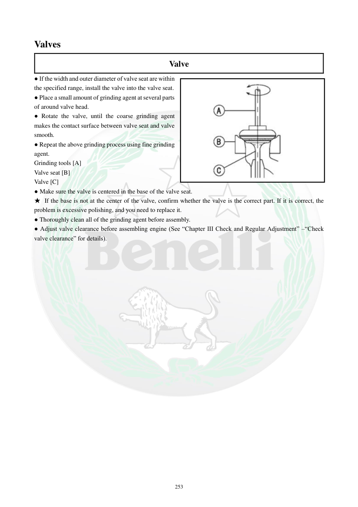

# Manual page 254

> Source: [page-0254.md](../source/page-0254.md)

## Page image / diagram

- [page-0254-img-01.jpeg](../images/embedded/page-0254-img-01.jpeg)

## Extracted text

# Source page 254

 
253 
Valves  
Valve  
● If the width and outer diameter of valve seat are within 
the specified range, install the valve into the valve seat.  
● Place a small amount of grinding agent at several parts 
of around valve head.  
● Rotate the valve, until the coarse grinding agent 
makes the contact surface between valve seat and valve 
smooth.  
● Repeat the above grinding process using fine grinding 
agent.  
Grinding tools [A] 
Valve seat [B] 
Valve [C] 
● Make sure the valve is centered in the base of the valve seat.  
★ If the base is not at the center of the valve, confirm whether the valve is the correct part. If it is correct, the 
problem is excessive polishing, and you need to replace it.  
● Thoroughly clean all of the grinding agent before assembly.  
● Adjust valve clearance before assembling engine (See “Chapter III Check and Regular Adjustment” –“Check 
valve clearance” for details).

## Persian notes

### لپ‌کردن نهایی سوپاپ و سیت
- وقتی قطر و عرض سیت در محدوده مشخص باشند، سوپاپ را روی سیت قرار دهید.
- مقدار کمی خمیر/ماده لپینگ در چند نقطه اطراف سر سوپاپ بزنید.
- سوپاپ را بچرخانید تا ماده زبر، سطح تماس سوپاپ و سیت را کاملاً هم‌سطح کند؛ سپس با ماده نرم‌تر همین کار را تکرار کنید.
- ابزار لپینگ **[A]**، سیت **[B]** و سوپاپ **[C]** هستند.
- مطمئن شوید رد تماس سوپاپ دقیقاً در مرکز پایه سیت قرار دارد.
- اگر تماس مرکزی نیست، ابتدا درست بودن قطعه سوپاپ را بررسی کنید؛ اگر قطعه درست باشد، دفترچه علت را **تراش بیش از حد** دانسته و تعویض را مطرح می‌کند.
- تمام بقایای ماده لپینگ را قبل از مونتاژ کاملاً پاک کنید.
- پیش از مونتاژ موتور، لقی سوپاپ را طبق فصل III تنظیم کنید.
