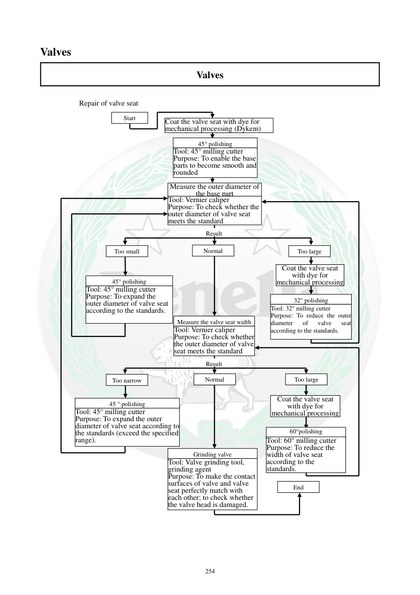

# Manual page 255

> Source: [page-0255.md](../source/page-0255.md)

## Page image / diagram

- [page-0255-img-01.png](../images/embedded/page-0255-img-01.png)

- [page-0255-img-02.png](../images/embedded/page-0255-img-02.png)

- [page-0255-img-03.png](../images/embedded/page-0255-img-03.png)

- [page-0255-img-04.png](../images/embedded/page-0255-img-04.png)

- [page-0255-img-05.png](../images/embedded/page-0255-img-05.png)

- [page-0255-img-06.png](../images/embedded/page-0255-img-06.png)

- [page-0255-img-07.png](../images/embedded/page-0255-img-07.png)

- [page-0255-img-08.png](../images/embedded/page-0255-img-08.png)

- [page-0255-img-09.png](../images/embedded/page-0255-img-09.png)

- [page-0255-img-10.png](../images/embedded/page-0255-img-10.png)

- [page-0255-img-11.png](../images/embedded/page-0255-img-11.png)

- [page-0255-img-12.png](../images/embedded/page-0255-img-12.png)

- [page-0255-img-13.png](../images/embedded/page-0255-img-13.png)

- [page-0255-img-14.png](../images/embedded/page-0255-img-14.png)

- [page-0255-img-15.png](../images/embedded/page-0255-img-15.png)

- [page-0255-img-17.png](../images/embedded/page-0255-img-17.png)

- [page-0255-img-19.png](../images/embedded/page-0255-img-19.png)

- [page-0255-img-20.png](../images/embedded/page-0255-img-20.png)

- [page-0255-img-21.png](../images/embedded/page-0255-img-21.png)

- [page-0255-img-22.png](../images/embedded/page-0255-img-22.png)

- [page-0255-img-23.png](../images/embedded/page-0255-img-23.png)

- [page-0255-img-24.png](../images/embedded/page-0255-img-24.png)

- [page-0255-img-25.png](../images/embedded/page-0255-img-25.png)

- [page-0255-img-26.png](../images/embedded/page-0255-img-26.png)

## Extracted text

# Source page 255

 
254 
Valves  
Valves  
 
 
 
Repair of valve seat 
Start 
Coat the valve seat with dye for 
mechanical processing (Dykem) 
45° polishing 
Tool: 45° milling cutter 
Purpose: To enable the base 
parts to become smooth and 
rounded 
Measure the outer diameter of 
the base part
Tool: Vernier caliper 
Purpose: To check whether the 
outer diameter of valve seat 
meets the standard 
Result 
Too small 
Normal 
Too large 
45° polishing 
Tool: 45° milling cutter 
Purpose: To expand the 
outer diameter of valve seat 
according to the standards. 
Measure the valve seat width 
Tool: Vernier caliper 
Purpose: To check whether 
the outer diameter of valve 
seat meets the standard 
Coat the valve seat 
with dye for 
mechanical processing 
32° polishing 
Tool: 32° milling cutter  
Purpose: To reduce the outer 
diameter 
of 
valve 
seat 
according to the standards. 
Result 
Normal 
Too narrow 
Too large 
45 ° polishing 
Tool: 45° milling cutter 
Purpose: To expand the outer 
diameter of valve seat according to
the standards (exceed the specified 
range). 
Grinding valve 
Tool: Valve grinding tool, 
grinding agent 
Purpose: To make the contact 
surfaces of valve and valve 
seat perfectly match with 
each other; to check whether 
the valve head is damaged.  
Coat the valve seat 
with dye for 
mechanical processing 
60°polishing 
Tool: 60° milling cutter 
Purpose: To reduce the 
width of valve seat 
according to the 
standards. 
End

## Persian notes

### فلوچارت تعمیر سیت سوپاپ
روند کلی صفحه: **Dykem → فرز 45° → اندازه‌گیری قطر → تصمیم کم/نرمال/زیاد → اصلاح با 45° یا 30° → اندازه‌گیری عرض → اصلاح با 45° یا 60° → لپینگ سوپاپ → پایان**.

- هدف فرز **45°** ایجاد سطح تماس و تنظیم قطر پایه سیت است.
- فرز **30°** برای کاهش قطر خارجی سیت به محدوده استاندارد استفاده می‌شود.
- فرز **60°** برای کاهش عرض سیت استفاده می‌شود.
- در پایان با ابزار لپینگ و ماده ساینده، تماس سوپاپ و سیت تطبیق داده می‌شود و آسیب سر سوپاپ نیز بررسی می‌گردد.
- ⚠️ متن استخراج‌شده در یک قسمت **32°** نوشته، در حالی که صفحات 251 تا 253 و روند فنی دفترچه از **30°** استفاده می‌کنند. این مورد به‌عنوان خطای استخراج/OCR در نظر گرفته شده و عدد 32° به‌عنوان مشخصه قطعی استفاده نمی‌شود.
