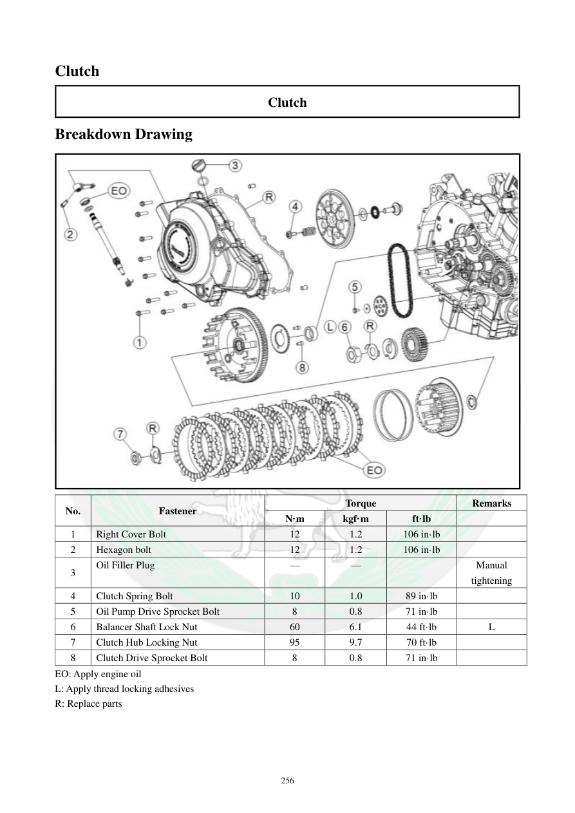

# Manual page 257

> Source: [page-0257.md](../source/page-0257.md)

## Page image / diagram

- [page-0257-img-01.jpeg](../images/embedded/page-0257-img-01.jpeg)

## Extracted text

# Source page 257

 
256 
Clutch  
Clutch  
Breakdown Drawing 
 
No.  
Fastener  
Torque  
Remarks  
N·m 
kgf·m 
ft·lb 
 
1 
Right Cover Bolt  
12 
1.2 
106 in·lb 
 
2 
Hexagon bolt 
12 
1.2 
106 in·lb 
 
3 
Oil Filler Plug  
— 
— 
 
Manual 
tightening  
4 
Clutch Spring Bolt  
10 
1.0 
89 in·lb 
 
5 
Oil Pump Drive Sprocket Bolt  
8 
0.8 
71 in·lb 
 
6 
Balancer Shaft Lock Nut  
60 
6.1 
44 ft·lb 
L 
7 
Clutch Hub Locking Nut  
95 
9.7 
70 ft·lb 
 
8 
Clutch Drive Sprocket Bolt   
8 
0.8 
71 in·lb 
 
EO: Apply engine oil   
L: Apply thread locking adhesives  
R: Replace parts

## Persian notes

<!-- Persian translation/explanation will be added here. -->
