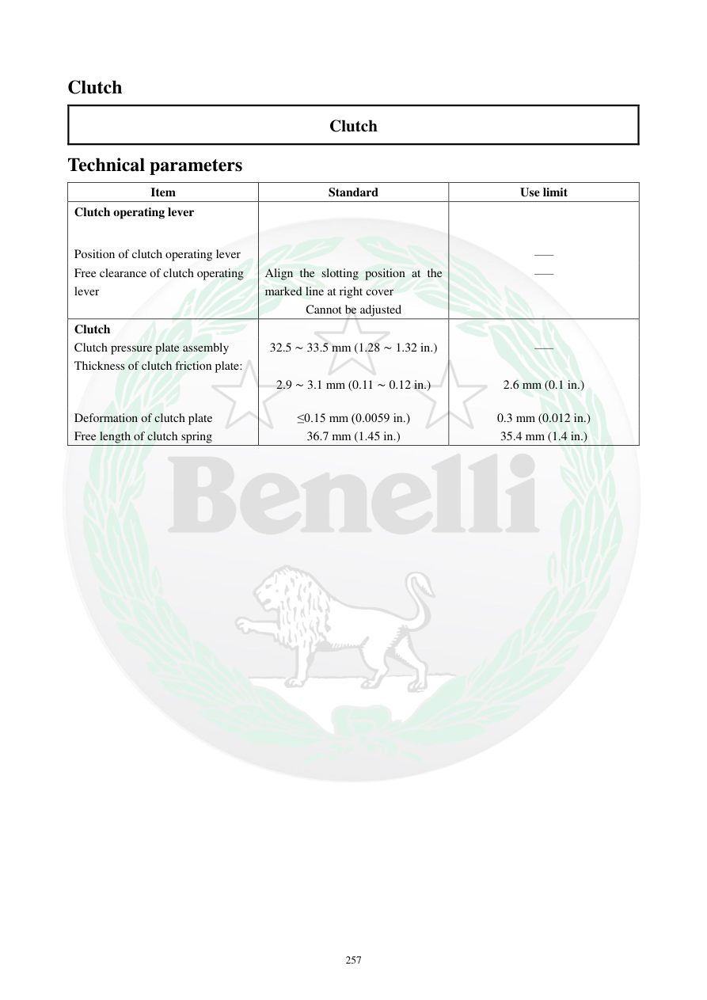

# Manual page 258

> Source: [page-0258.md](../source/page-0258.md)

## Page image / diagram

## Extracted text

# Source page 258

 
257 
Clutch  
Clutch  
Technical parameters  
Item  
Standard  
Use limit  
Clutch operating lever  
 
 
Position of clutch operating lever 
 
––– 
Free clearance of clutch operating 
lever  
Align the slotting position at the 
marked line at right cover  
Cannot be adjusted  
––– 
Clutch  
 
 
Clutch pressure plate assembly  
32.5 ∼ 33.5 mm (1.28 ∼ 1.32 in.) 
––– 
Thickness of clutch friction plate:  
 
 
 
2.9 ∼ 3.1 mm (0.11 ∼ 0.12 in.) 
2.6 mm (0.1 in.) 
Deformation of clutch plate  
≤0.15 mm (0.0059 in.) 
0.3 mm (0.012 in.) 
Free length of clutch spring  
36.7 mm (1.45 in.) 
35.4 mm (1.4 in.)

## Persian notes

<!-- Persian translation/explanation will be added here. -->
