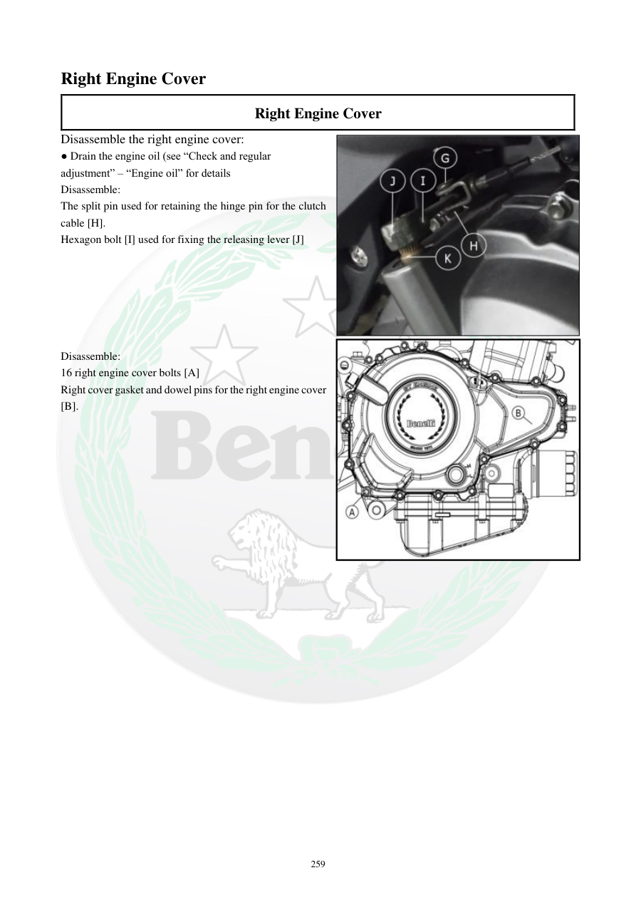

# Manual page 260

> Source: [page-0260.md](../source/page-0260.md)

## Page image / diagram

- [page-0260-img-01.jpeg](../images/embedded/page-0260-img-01.jpeg)

- [page-0260-img-02.jpeg](../images/embedded/page-0260-img-02.jpeg)

## Extracted text

# Source page 260

 
259 
Right Engine Cover  
Right Engine Cover  
Disassemble the right engine cover:  
● Drain the engine oil (see “Check and regular 
adjustment” – “Engine oil” for details  
Disassemble:  
The split pin used for retaining the hinge pin for the clutch 
cable [H]. 
Hexagon bolt [I] used for fixing the releasing lever [J] 
 
 
 
 
 
 
Disassemble:  
16 right engine cover bolts [A] 
Right cover gasket and dowel pins for the right engine cover 
[B].

## Persian notes

<!-- Persian translation/explanation will be added here. -->
