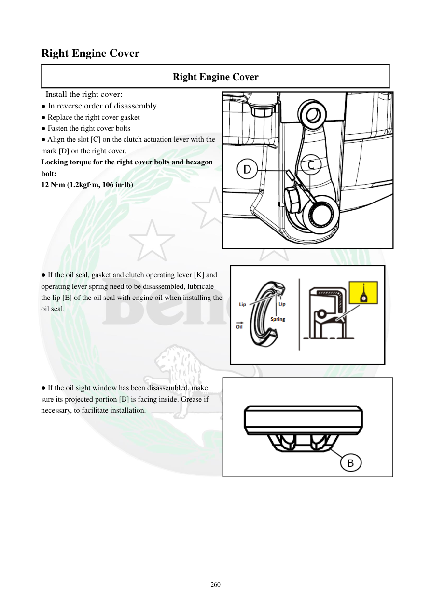

# Manual page 261

> Source: [page-0261.md](../source/page-0261.md)

## Page image / diagram

- [page-0261-img-01.png](../images/embedded/page-0261-img-01.png)

- [page-0261-img-02.png](../images/embedded/page-0261-img-02.png)

## Extracted text

# Source page 261

 
260 
Right Engine Cover  
Right Engine Cover  
 Install the right cover: 
● In reverse order of disassembly 
● Replace the right cover gasket  
● Fasten the right cover bolts  
● Align the slot [C] on the clutch actuation lever with the 
mark [D] on the right cover.  
Locking torque for the right cover bolts and hexagon 
bolt:  
12 N·m (1.2kgf·m, 106 in·lb) 
 
 
 
 
 
 
 
● If the oil seal, gasket and clutch operating lever [K] and 
operating lever spring need to be disassembled, lubricate 
the lip [E] of the oil seal with engine oil when installing the 
oil seal. 
 
 
 
 
 
 
● If the oil sight window has been disassembled, make 
sure its projected portion [B] is facing inside. Grease if 
necessary, to facilitate installation.

## Persian notes

<!-- Persian translation/explanation will be added here. -->
