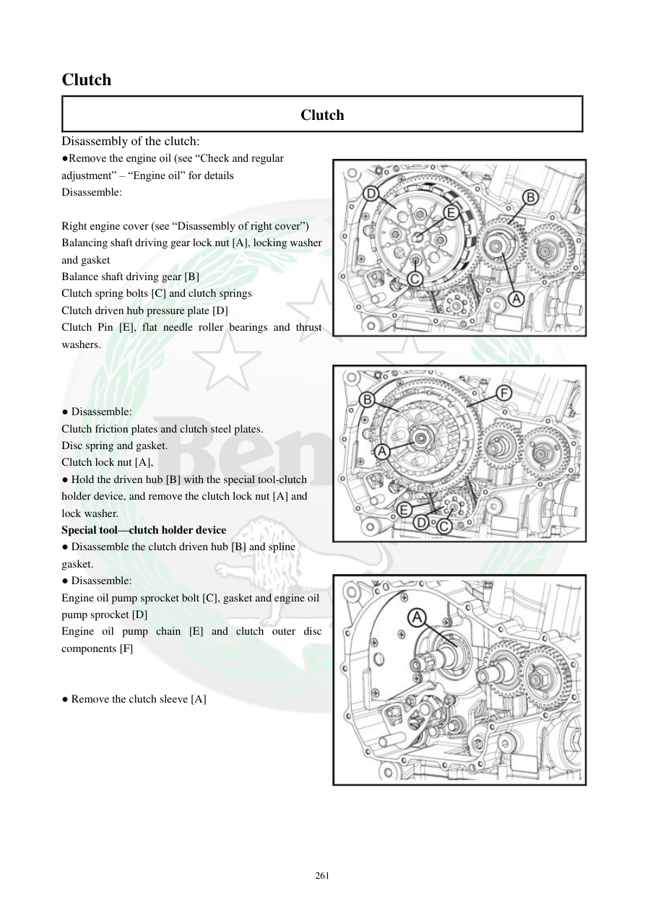

# Manual page 262

> Source: [page-0262.md](../source/page-0262.md)

## Page image / diagram

- [page-0262-img-01.jpeg](../images/embedded/page-0262-img-01.jpeg)

- [page-0262-img-02.jpeg](../images/embedded/page-0262-img-02.jpeg)

- [page-0262-img-03.jpeg](../images/embedded/page-0262-img-03.jpeg)

## Extracted text

# Source page 262

 
261 
Clutch  
Clutch  
Disassembly of the clutch:  
●Remove the engine oil (see “Check and regular 
adjustment” – “Engine oil” for details  
Disassemble:  
 
Right engine cover (see “Disassembly of right cover”) 
Balancing shaft driving gear lock nut [A], locking washer 
and gasket 
Balance shaft driving gear [B] 
Clutch spring bolts [C] and clutch springs 
Clutch driven hub pressure plate [D] 
Clutch Pin [E], flat needle roller bearings and thrust 
washers.   
 
 
  
● Disassemble:  
Clutch friction plates and clutch steel plates. 
Disc spring and gasket. 
Clutch lock nut [A], 
● Hold the driven hub [B] with the special tool-clutch 
holder device, and remove the clutch lock nut [A] and 
lock washer.  
Special tool—clutch holder device 
● Disassemble the clutch driven hub [B] and spline 
gasket.  
● Disassemble:  
Engine oil pump sprocket bolt [C], gasket and engine oil 
pump sprocket [D] 
Engine oil pump chain [E] and clutch outer disc 
components [F] 
 
 
● Remove the clutch sleeve [A]

## Persian notes

### بازکردن مجموعه کلاچ
1. روغن موتور را تخلیه کنید.
2. کاور راست موتور را باز کنید.
3. مهره قفل چرخ‌دنده محرک شفت بالانسر **[A]**، واشر قفل و واشر آب‌بندی را باز کنید.
4. چرخ‌دنده محرک بالانسر **[B]**، پیچ‌های فنر کلاچ **[C]** و فنرها را خارج کنید.
5. صفحه فشار توپی کلاچ **[D]**، پین کلاچ **[E]**، یاتاقان سوزنی تخت و واشرهای تراست را خارج کنید.
6. صفحات اصطکاکی و فولادی کلاچ، فنر دیسکی و واشر را خارج کنید.
7. با **ابزار نگهدارنده کلاچ** توپی را ثابت کرده و مهره قفل کلاچ و واشر قفل را باز کنید.
8. توپی کلاچ و واشر شیاردار، سپس چرخ‌دنده/زنجیر پمپ روغن و مجموعه سبد بیرونی کلاچ را جدا کنید.
9. در پایان بوش/غلاف کلاچ **[A]** را خارج کنید.
