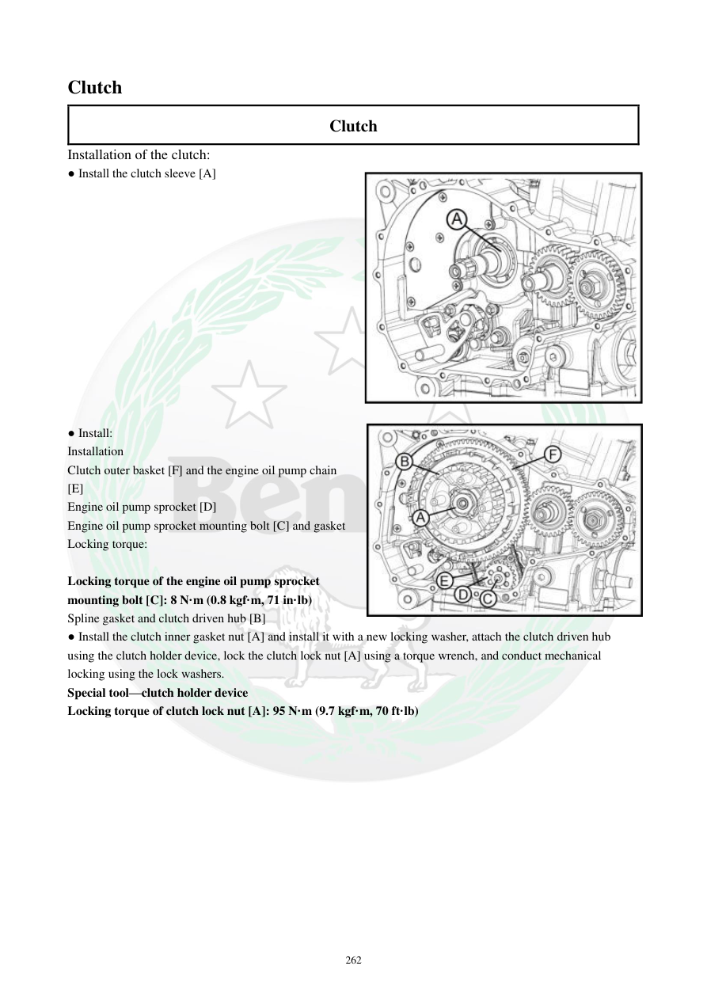

# Manual page 263

> Source: [page-0263.md](../source/page-0263.md)

## Page image / diagram

- [page-0263-img-01.jpeg](../images/embedded/page-0263-img-01.jpeg)

- [page-0263-img-02.jpeg](../images/embedded/page-0263-img-02.jpeg)

## Extracted text

# Source page 263

 
262 
Clutch  
Clutch  
Installation of the clutch:  
● Install the clutch sleeve [A] 
 
 
 
 
 
 
 
 
 
 
 
 
 
● Install:  
Installation 
Clutch outer basket [F] and the engine oil pump chain 
[E] 
Engine oil pump sprocket [D] 
Engine oil pump sprocket mounting bolt [C] and gasket  
Locking torque: 
 
Locking torque of the engine oil pump sprocket 
mounting bolt [C]: 8 N·m (0.8 kgf·m, 71 in·lb) 
Spline gasket and clutch driven hub [B] 
● Install the clutch inner gasket nut [A] and install it with a new locking washer, attach the clutch driven hub 
using the clutch holder device, lock the clutch lock nut [A] using a torque wrench, and conduct mechanical 
locking using the lock washers.   
Special tool—clutch holder device 
Locking torque of clutch lock nut [A]: 95 N·m (9.7 kgf·m, 70 ft·lb)

## Persian notes

<!-- Persian translation/explanation will be added here. -->
