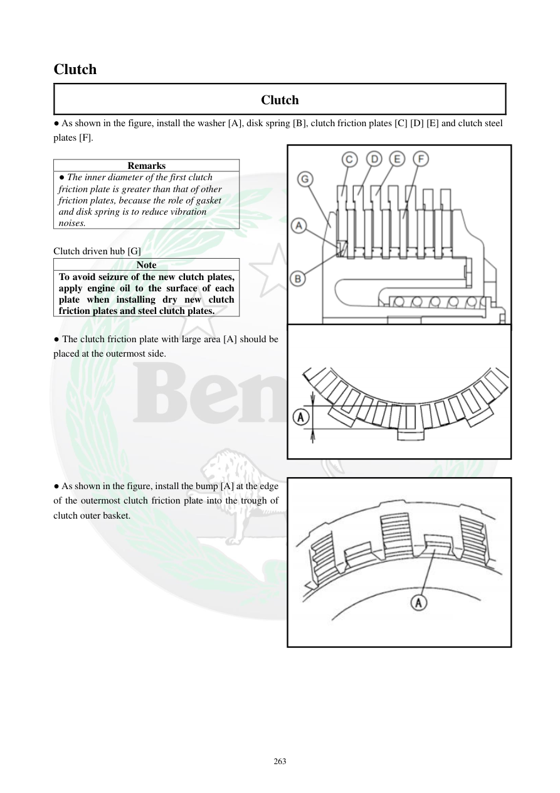

# Manual page 264

> Source: [page-0264.md](../source/page-0264.md)

## Page image / diagram

- [page-0264-img-01.png](../images/embedded/page-0264-img-01.png)

- [page-0264-img-02.png](../images/embedded/page-0264-img-02.png)

- [page-0264-img-03.jpeg](../images/embedded/page-0264-img-03.jpeg)

## Extracted text

# Source page 264

 
263 
Clutch  
Clutch  
● As shown in the figure, install the washer [A], disk spring [B], clutch friction plates [C] [D] [E] and clutch steel 
plates [F].  
 
Remarks  
● The inner diameter of the first clutch 
friction plate is greater than that of other 
friction plates, because the role of gasket 
and disk spring is to reduce vibration 
noises.  
 
Clutch driven hub [G]  
Note  
To avoid seizure of the new clutch plates, 
apply engine oil to the surface of each 
plate when installing dry new clutch 
friction plates and steel clutch plates.  
 
● The clutch friction plate with large area [A] should be 
placed at the outermost side.  
 
 
 
 
 
 
 
 
● As shown in the figure, install the bump [A] at the edge 
of the outermost clutch friction plate into the trough of 
clutch outer basket.

## Persian notes

### نصب صفحات کلاچ
- واشر **[A]**، فنر دیسکی **[B]**، صفحات اصطکاکی **[C][D][E]** و صفحات فولادی **[F]** طبق تصویر نصب شوند.
- قطر داخلی اولین صفحه اصطکاکی با صفحات دیگر متفاوت است، چون این مجموعه همراه فنر دیسکی و واشر برای کاهش لرزش و صدا طراحی شده است.
- برای جلوگیری از چسبیدن/گیرپاژ صفحات نو، روی سطح **هر صفحه اصطکاکی و فولادی** قبل از نصب روغن موتور بزنید.
- صفحه اصطکاکی با سطح بزرگ‌تر **[A]** باید در **بیرونی‌ترین موقعیت** قرار گیرد.
- برجستگی **[A]** لبه صفحه اصطکاکی بیرونی باید داخل شیار سبد بیرونی کلاچ قرار گیرد.
- ترتیب دقیق صفحات را حتماً با تصویر صفحه تطبیق دهید.
