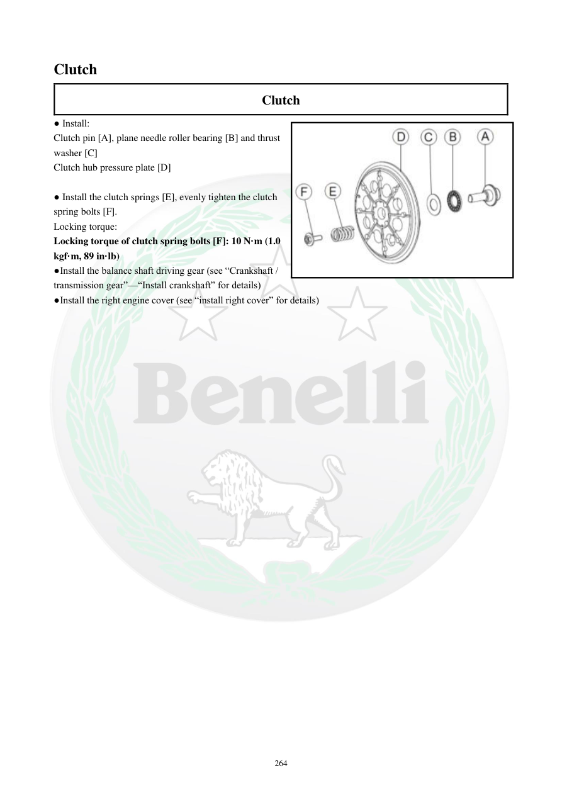

# Manual page 265

> Source: [page-0265.md](../source/page-0265.md)

## Page image / diagram

- [page-0265-img-01.jpeg](../images/embedded/page-0265-img-01.jpeg)

## Extracted text

# Source page 265

 
264 
Clutch  
Clutch  
● Install:  
Clutch pin [A], plane needle roller bearing [B] and thrust 
washer [C] 
Clutch hub pressure plate [D] 
 
● Install the clutch springs [E], evenly tighten the clutch 
spring bolts [F]. 
Locking torque:  
Locking torque of clutch spring bolts [F]: 10 N·m (1.0 
kgf·m, 89 in·lb) 
●Install the balance shaft driving gear (see “Crankshaft / 
transmission gear”—“Install crankshaft” for details) 
●Install the right engine cover (see “install right cover” for details)

## Persian notes

### بستن نهایی کلاچ
- پین کلاچ **[A]**، یاتاقان سوزنی تخت **[B]** و واشر تراست **[C]** را نصب کنید.
- صفحه فشار توپی کلاچ **[D]** را نصب کنید.
- فنرهای کلاچ **[E]** را قرار دهید و پیچ‌های فنر **[F]** را به‌صورت یکنواخت سفت کنید.
- گشتاور پیچ فنر کلاچ: **10 N·m = 1.0 kgf·m = 89 in·lb**.
- چرخ‌دنده محرک شفت بالانسر را طبق بخش «میل‌لنگ/چرخ‌دنده گیربکس» نصب کنید.
- سپس کاور راست موتور را طبق روش صفحه 261 نصب کنید.
