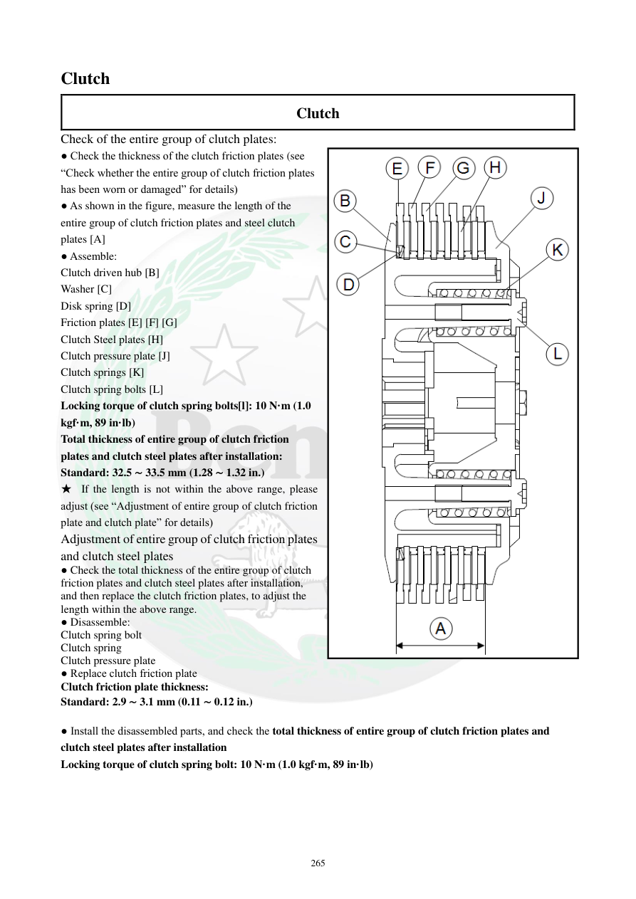

# Manual page 266

> Source: [page-0266.md](../source/page-0266.md)

## Page image / diagram

- [page-0266-img-01.png](../images/embedded/page-0266-img-01.png)

## Extracted text

# Source page 266

 
265 
Clutch  
Clutch  
Check of the entire group of clutch plates:  
● Check the thickness of the clutch friction plates (see 
“Check whether the entire group of clutch friction plates 
has been worn or damaged” for details)  
● As shown in the figure, measure the length of the 
entire group of clutch friction plates and steel clutch 
plates [A] 
● Assemble:  
Clutch driven hub [B] 
Washer [C] 
Disk spring [D] 
Friction plates [E] [F] [G] 
Clutch Steel plates [H]  
Clutch pressure plate [J] 
Clutch springs [K] 
Clutch spring bolts [L] 
Locking torque of clutch spring bolts[l]: 10 N·m (1.0 
kgf·m, 89 in·lb) 
Total thickness of entire group of clutch friction 
plates and clutch steel plates after installation:  
Standard: 32.5 ∼ 33.5 mm (1.28 ∼ 1.32 in.) 
★ If the length is not within the above range, please 
adjust (see “Adjustment of entire group of clutch friction 
plate and clutch plate” for details) 
Adjustment of entire group of clutch friction plates 
and clutch steel plates 
● Check the total thickness of the entire group of clutch 
friction plates and clutch steel plates after installation, 
and then replace the clutch friction plates, to adjust the 
length within the above range.  
● Disassemble:  
Clutch spring bolt  
Clutch spring 
Clutch pressure plate  
● Replace clutch friction plate  
Clutch friction plate thickness: 
Standard: 2.9 ∼ 3.1 mm (0.11 ∼ 0.12 in.) 
 
● Install the disassembled parts, and check the total thickness of entire group of clutch friction plates and 
clutch steel plates after installation  
Locking torque of clutch spring bolt: 10 N·m (1.0 kgf·m, 89 in·lb)

## Persian notes

### کنترل ضخامت کل مجموعه صفحات کلاچ
- ضخامت کل مجموعه صفحات اصطکاکی و فولادی پس از نصب: استاندارد **32.5–33.5 mm**.
- اگر ضخامت کل خارج از این محدوده باشد، با تعویض صفحات اصطکاکی مجموعه را به محدوده مشخص برگردانید.
- ضخامت استاندارد هر صفحه اصطکاکی: **2.9–3.1 mm**.
- هنگام مونتاژ مجدد، گشتاور پیچ فنر کلاچ: **10 N·m = 1.0 kgf·m = 89 in·lb**.
- اندازه‌گیری ضخامت کل باید پس از چیدمان صحیح همه صفحات و نصب صفحه فشار/فنرها انجام شود، نه صرفاً با جمع اعداد اسمی صفحات.
