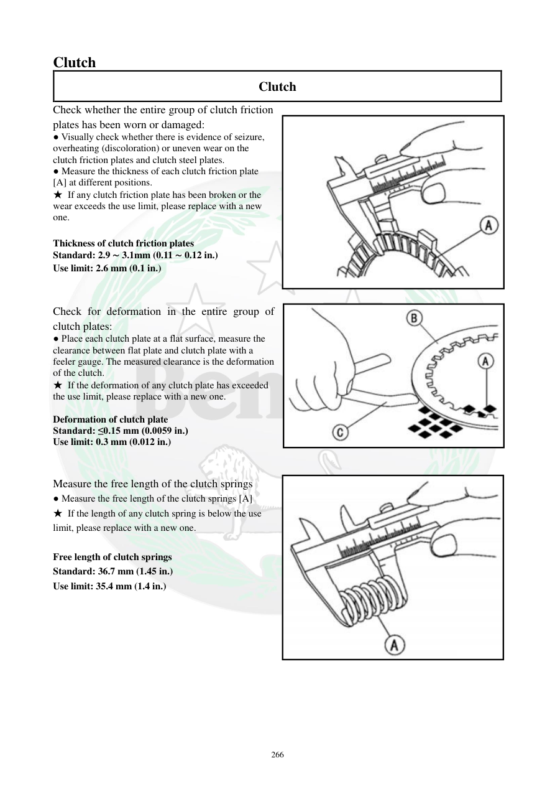

# Manual page 267

> Source: [page-0267.md](../source/page-0267.md)

## Page image / diagram

- [page-0267-img-01.jpeg](../images/embedded/page-0267-img-01.jpeg)

- [page-0267-img-02.jpeg](../images/embedded/page-0267-img-02.jpeg)

- [page-0267-img-03.jpeg](../images/embedded/page-0267-img-03.jpeg)

## Extracted text

# Source page 267

 
266 
Clutch  
Clutch  
Check whether the entire group of clutch friction 
plates has been worn or damaged: 
● Visually check whether there is evidence of seizure, 
overheating (discoloration) or uneven wear on the 
clutch friction plates and clutch steel plates.   
● Measure the thickness of each clutch friction plate 
[A] at different positions.  
★ If any clutch friction plate has been broken or the 
wear exceeds the use limit, please replace with a new 
one.  
 
Thickness of clutch friction plates  
Standard: 2.9 ∼ 3.1mm (0.11 ∼ 0.12 in.) 
Use limit: 2.6 mm (0.1 in.) 
 
 
Check for deformation in the entire group of 
clutch plates:  
● Place each clutch plate at a flat surface, measure the 
clearance between flat plate and clutch plate with a 
feeler gauge. The measured clearance is the deformation 
of the clutch.  
★ If the deformation of any clutch plate has exceeded 
the use limit, please replace with a new one.  
 
Deformation of clutch plate  
Standard: ≤0.15 mm (0.0059 in.) 
Use limit: 0.3 mm (0.012 in.) 
 
 
Measure the free length of the clutch springs  
● Measure the free length of the clutch springs [A] 
★ If the length of any clutch spring is below the use 
limit, please replace with a new one.  
 
Free length of clutch springs 
Standard: 36.7 mm (1.45 in.) 
Use limit: 35.4 mm (1.4 in.)

## Persian notes

<!-- Persian translation/explanation will be added here. -->
