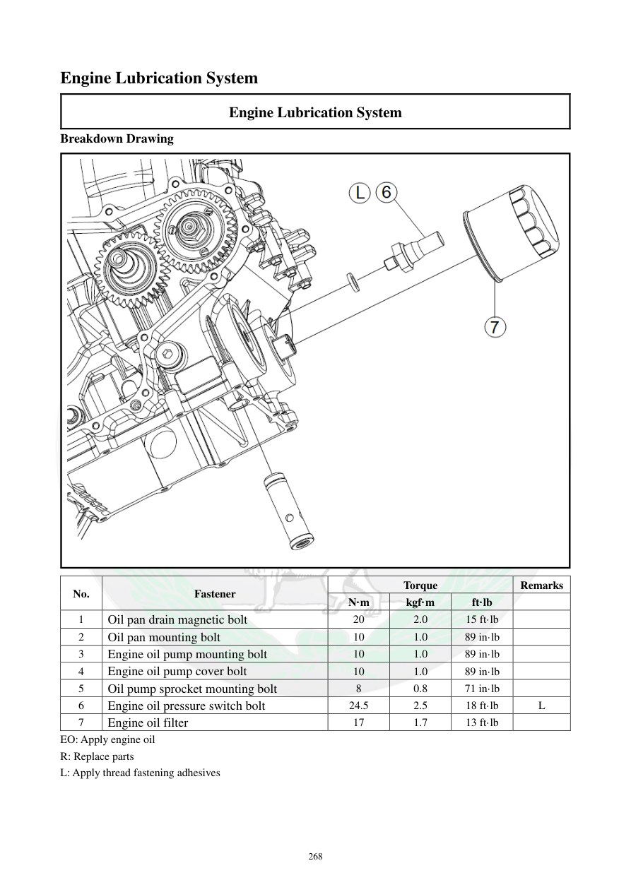

# Manual page 269

> Source: [page-0269.md](../source/page-0269.md)

## Page image / diagram

- [page-0269-img-01.png](../images/embedded/page-0269-img-01.png)

## Extracted text

# Source page 269

 
268 
Engine Lubrication System 
Engine Lubrication System 
Breakdown Drawing 
 
No.  
Fastener  
Torque  
Remarks  
N·m 
kgf·m 
ft·lb 
 
1 
Oil pan drain magnetic bolt 
20 
2.0 
15 ft·lb 
 
2 
Oil pan mounting bolt 
10 
1.0 
89 in·lb 
 
3 
Engine oil pump mounting bolt 
10 
1.0 
89 in·lb 
 
4 
Engine oil pump cover bolt 
10 
1.0 
89 in·lb 
 
5 
Oil pump sprocket mounting bolt 
8 
0.8 
71 in·lb 
 
6 
Engine oil pressure switch bolt 
24.5 
2.5 
18 ft·lb 
L 
7 
Engine oil filter 
17 
1.7 
13 ft·lb 
 
EO: Apply engine oil   
R: Replace parts  
L: Apply thread fastening adhesives

## Persian notes

<!-- Persian translation/explanation will be added here. -->
