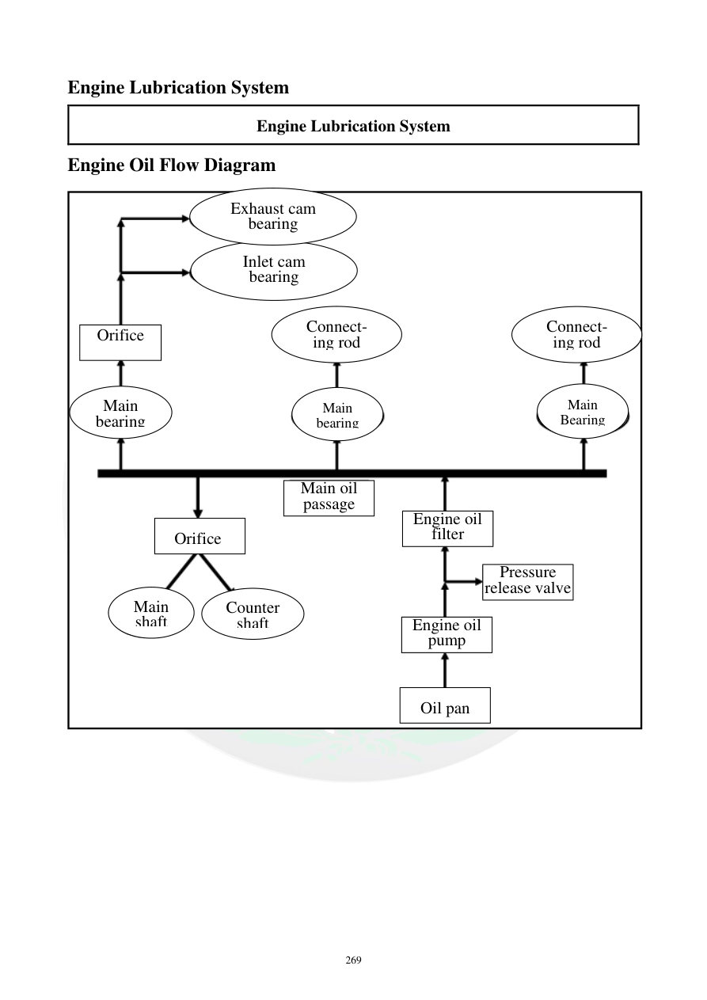

# Manual page 270

> Source: [page-0270.md](../source/page-0270.md)

## Page image / diagram

- [page-0270-img-01.png](../images/embedded/page-0270-img-01.png)

- [page-0270-img-02.png](../images/embedded/page-0270-img-02.png)

- [page-0270-img-03.png](../images/embedded/page-0270-img-03.png)

- [page-0270-img-04.png](../images/embedded/page-0270-img-04.png)

- [page-0270-img-05.png](../images/embedded/page-0270-img-05.png)

- [page-0270-img-06.png](../images/embedded/page-0270-img-06.png)

- [page-0270-img-08.png](../images/embedded/page-0270-img-08.png)

- [page-0270-img-09.png](../images/embedded/page-0270-img-09.png)

- [page-0270-img-10.png](../images/embedded/page-0270-img-10.png)

- [page-0270-img-11.png](../images/embedded/page-0270-img-11.png)

- [page-0270-img-12.png](../images/embedded/page-0270-img-12.png)

## Extracted text

# Source page 270

 
269 
Engine Lubrication System 
Engine Lubrication System 
Engine Oil Flow Diagram  
 
 
 
 
Orifice 
Main 
bearing
Orifice  
Main 
shaft
Counter 
shaft
Main oil 
passage 
Main 
bearing 
Connect-
ing rod 
Inlet cam 
bearing  
Exhaust cam 
bearing  
Connect- 
ing rod 
Main 
Bearing
Engine oil 
filter  
Pressure 
release valve 
Engine oil 
pump 
Oil pan

## Persian notes

### مسیر روغن موتور و ارتباط آن با ناحیه استارت
نقشه جریان روغن نشان می‌دهد روغن از **کارتل → پمپ روغن → فیلتر روغن → مسیر اصلی روغن** می‌رود و سپس به یاتاقان‌های اصلی، شاتون، میل‌سوپاپ‌ها و مسیرهای دیگر توزیع می‌شود.

در این دیاگرام، **مسیر مستقیمی از مدار روغن به داخل موتور استارت نشان داده نشده است**. بنابراین اگر داخل پوسته استارت روغن دیده شده، باید بین دو حالت تفاوت گذاشت:
1. روغن از محل آب‌بندی محل نصب استارت وارد شده باشد.
2. روغن از سمت شفت/کاسه‌نمد جلوی استارت به داخل پوسته نفوذ کرده باشد.

این نتیجه با نقشه قطعات TNT249S هم سازگار است: موتور استارت با یک **O-Ring مستقل 24×3.1 mm** در مجموعه E11 آب‌بندی می‌شود، در حالی که خود دفترچه سرویس برای جلوی استارت یک **oil seal** را هنگام مونتاژ مشخص می‌کند. citeturn0search12turn0search14

### نکته مهم برای عیب فعلی
پس از تعمیر زغال‌ها، قبل از نصب نهایی استارت، محل نشستن O-Ring و کاسه‌نمد جلوی استارت تمیز و بررسی شود. اگر اطراف محل اتصال استارت خشک باشد ولی داخل استارت دوباره روغنی شود، تمرکز بررسی باید روی **oil seal و سطح شفت آرمیچر** باشد، نه فقط O-Ring بیرونی.

