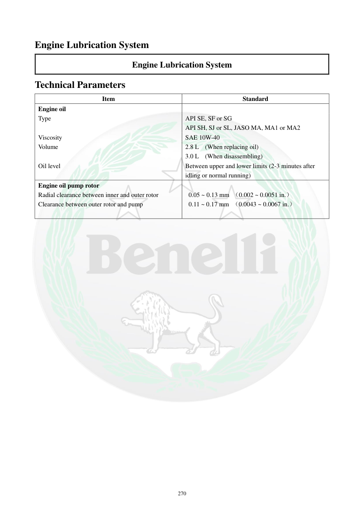

# Manual page 271

> Source: [page-0271.md](../source/page-0271.md)

## Page image / diagram

## Extracted text

# Source page 271

 
270 
Engine Lubrication System 
Engine Lubrication System 
Technical Parameters  
Item  
Standard  
Engine oil  
 
Type  
API SE, SF or SG 
API SH, SJ or SL, JASO MA, MA1 or MA2 
Viscosity 
SAE 10W-40 
Volume  
2.8 L  (When replacing oil)  
3.0 L  (When disassembling) 
Oil level  
Between upper and lower limits (2-3 minutes after 
idling or normal running) 
Engine oil pump rotor 
 
Radial clearance between inner and outer rotor  
Clearance between outer rotor and pump  
 
 0.05 ~ 0.13 mm （0.002 ~ 0.0051 in.） 
 0.11 ~ 0.17 mm （0.0043 ~ 0.0067 in.）

## Persian notes

### مشخصات فنی سیستم روغن‌کاری
- روغن موتور: **API SE/SF/SG** و نیز **API SH/SJ/SL، JASO MA/MA1/MA2**.
- گرانروی: **SAE 10W-40**.
- حجم روغن هنگام تعویض: **2.8 L**.
- حجم هنگام بازکردن/دمونتاژ موتور: **3.0 L**.
- سطح روغن باید بین علامت بالا و پایین sight glass باشد؛ کنترل طبق دفترچه **2 تا 3 دقیقه پس از درجا کار کردن یا کارکرد عادی** انجام می‌شود.
- لقی شعاعی بین روتور داخلی و خارجی پمپ روغن: **0.05–0.13 mm**.
- لقی بین روتور خارجی و بدنه پمپ: **0.11–0.17 mm**.
