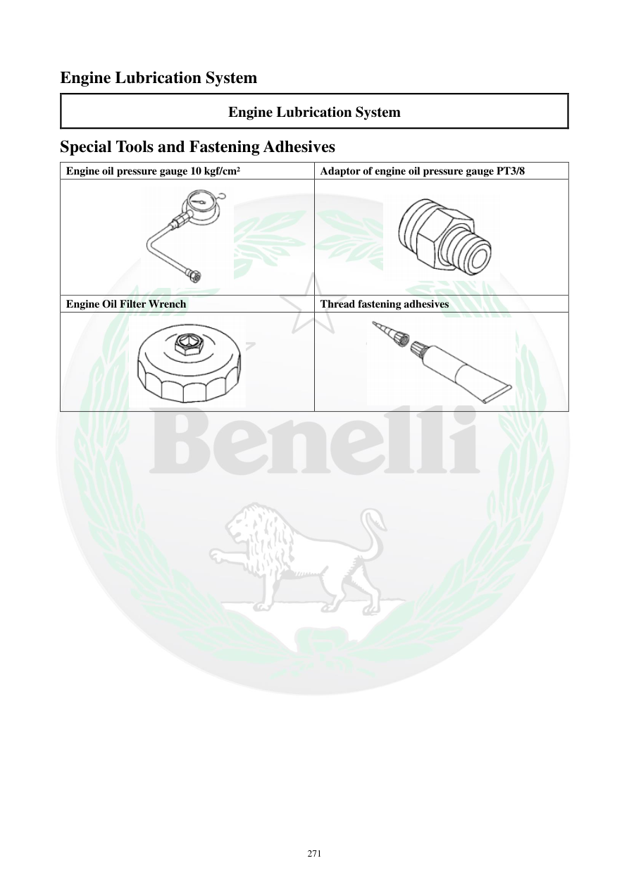

# Manual page 272

> Source: [page-0272.md](../source/page-0272.md)

## Page image / diagram

- [page-0272-img-01.png](../images/embedded/page-0272-img-01.png)

- [page-0272-img-02.png](../images/embedded/page-0272-img-02.png)

- [page-0272-img-03.png](../images/embedded/page-0272-img-03.png)

- [page-0272-img-04.png](../images/embedded/page-0272-img-04.png)

## Extracted text

# Source page 272

 
271 
Engine Lubrication System 
Engine Lubrication System 
Special Tools and Fastening Adhesives  
Engine oil pressure gauge 10 kgf/cm² 
Adaptor of engine oil pressure gauge PT3/8 
 
 
Engine Oil Filter Wrench  
Thread fastening adhesives

## Persian notes

### ابزار مخصوص سیستم روغن‌کاری
- گیج فشار روغن موتور: **10 kgf/cm²**.
- آداپتور گیج فشار روغن: **PT3/8**.
- آچار فیلتر روغن.
- چسب قفل‌کننده رزوه.
- هنگام استفاده از ابزار اندازه‌گیری فشار، رزوه و آب‌بندی آداپتور باید مطابق مشخصات ابزار و شکل صفحه باشد.
