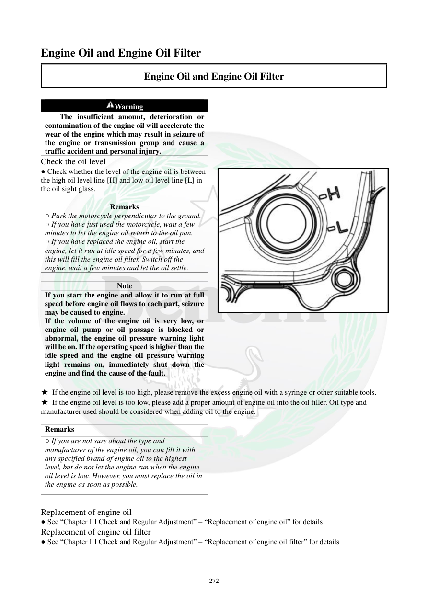

# Manual page 273

> Source: [page-0273.md](../source/page-0273.md)

## Page image / diagram

- [page-0273-img-01.png](../images/embedded/page-0273-img-01.png)

- [page-0273-img-02.jpeg](../images/embedded/page-0273-img-02.jpeg)

## Extracted text

# Source page 273

 
272 
Engine Oil and Engine Oil Filter  
Engine Oil and Engine Oil Filter  
 
Warning  
The insufficient amount, deterioration or 
contamination of the engine oil will accelerate the 
wear of the engine which may result in seizure of 
the engine or transmission group and cause a 
traffic accident and personal injury.  
Check the oil level 
● Check whether the level of the engine oil is between 
the high oil level line [H] and low oil level line [L] in 
the oil sight glass.  
 
Remarks  
○ Park the motorcycle perpendicular to the ground.  
○ If you have just used the motorcycle, wait a few 
minutes to let the engine oil return to the oil pan. 
○ If you have replaced the engine oil, start the 
engine, let it run at idle speed for a few minutes, and 
this will fill the engine oil filter. Switch off the 
engine, wait a few minutes and let the oil settle. 
 
Note  
If you start the engine and allow it to run at full 
speed before engine oil flows to each part, seizure 
may be caused to engine.  
If the volume of the engine oil is very low, or 
engine oil pump or oil passage is blocked or 
abnormal, the engine oil pressure warning light 
will be on. If the operating speed is higher than the 
idle speed and the engine oil pressure warning 
light remains on, immediately shut down the 
engine and find the cause of the fault.    
 
★ If the engine oil level is too high, please remove the excess engine oil with a syringe or other suitable tools. 
★ If the engine oil level is too low, please add a proper amount of engine oil into the oil filler. Oil type and 
manufacturer used should be considered when adding oil to the engine. 
 
Remarks  
○ If you are not sure about the type and 
manufacturer of the engine oil, you can fill it with 
any specified brand of engine oil to the highest 
level, but do not let the engine run when the engine 
oil level is low. However, you must replace the oil in 
the engine as soon as possible.  
 
Replacement of engine oil  
● See “Chapter III Check and Regular Adjustment” – “Replacement of engine oil” for details  
Replacement of engine oil filter  
● See “Chapter III Check and Regular Adjustment” – “Replacement of engine oil filter” for details

## Persian notes

<!-- Persian translation/explanation will be added here. -->
