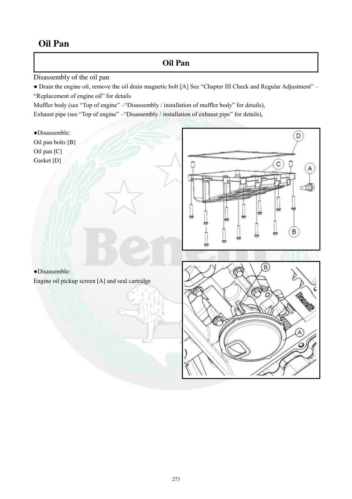

# Manual page 274

> Source: [page-0274.md](../source/page-0274.md)

## Page image / diagram

- [page-0274-img-01.jpeg](../images/embedded/page-0274-img-01.jpeg)

- [page-0274-img-02.jpeg](../images/embedded/page-0274-img-02.jpeg)

## Extracted text

# Source page 274

 
273 
 Oil Pan 
Oil Pan 
Disassembly of the oil pan 
● Drain the engine oil, remove the oil drain magnetic bolt [A] See “Chapter III Check and Regular Adjustment” – 
“Replacement of engine oil” for details  
Muffler body (see “Top of engine” –“Disassembly / installation of muffler body” for details), 
Exhaust pipe (see “Top of engine” –“Disassembly / installation of exhaust pipe” for details), 
 
●Disassemble:  
Oil pan bolts [B] 
Oil pan [C] 
Gasket [D] 
 
 
 
 
 
 
 
 
 
 
 
●Disassemble:  
Engine oil pickup screen [A] and seal cartridge

## Persian notes

### بازکردن کارتل روغن
1. روغن موتور را تخلیه و پیچ تخلیه مغناطیسی **[A]** را باز کنید.
2. بدنه صداخفه‌کن و لوله اگزوز را طبق بخش‌های مربوط باز کنید.
3. پیچ‌های کارتل **[B]** را باز کرده و کارتل **[C]** و واشر **[D]** را جدا کنید.
4. توری مکش روغن موتور **[A]** و کارتریج/آب‌بندی آن را خارج کنید.
- برای ترتیب دقیق قطعات و محل پیچ‌ها از تصویر صفحه استفاده شود.
