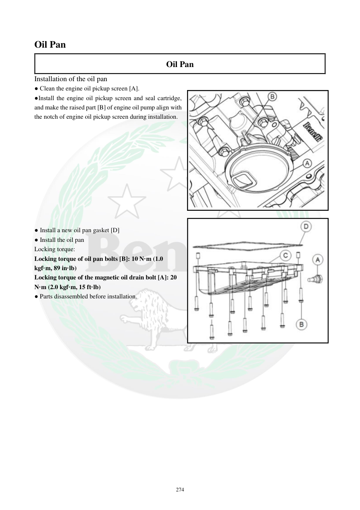

# Manual page 275

> Source: [page-0275.md](../source/page-0275.md)

## Page image / diagram

- [page-0275-img-02.jpeg](../images/embedded/page-0275-img-02.jpeg)

## Extracted text

# Source page 275

 
274 
Oil Pan 
Oil Pan 
Installation of the oil pan  
● Clean the engine oil pickup screen [A].  
●Install the engine oil pickup screen and seal cartridge, 
and make the raised part [B] of engine oil pump align with 
the notch of engine oil pickup screen during installation.  
 
 
 
 
 
 
 
 
 
 
 
● Install a new oil pan gasket [D] 
● Install the oil pan  
Locking torque:  
Locking torque of oil pan bolts [B]: 10 N·m (1.0 
kgf·m, 89 in·lb)  
Locking torque of the magnetic oil drain bolt [A]: 20 
N·m (2.0 kgf·m, 15 ft·lb)  
● Parts disassembled before installation.

## Persian notes

<!-- Persian translation/explanation will be added here. -->
