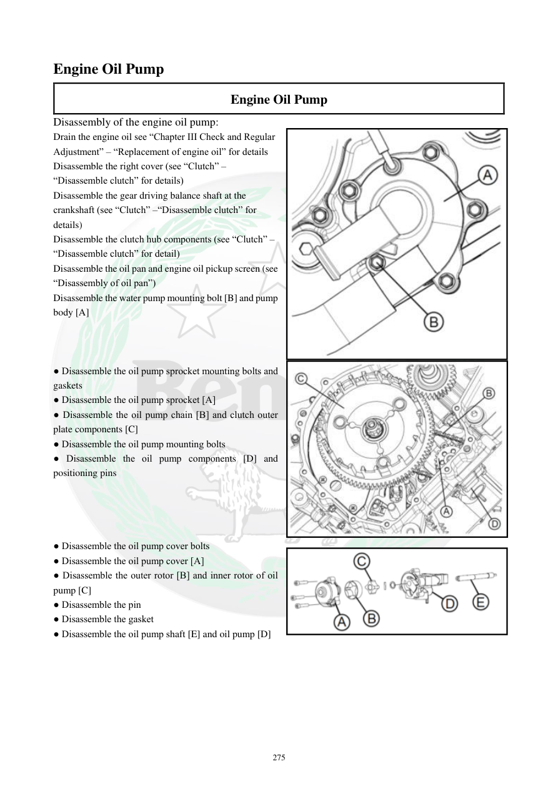

# Manual page 276

> Source: [page-0276.md](../source/page-0276.md)

## Page image / diagram

- [page-0276-img-01.jpeg](../images/embedded/page-0276-img-01.jpeg)

- [page-0276-img-02.jpeg](../images/embedded/page-0276-img-02.jpeg)

- [page-0276-img-03.png](../images/embedded/page-0276-img-03.png)

## Extracted text

# Source page 276

 
275 
Engine Oil Pump  
Engine Oil Pump 
Disassembly of the engine oil pump: 
Drain the engine oil see “Chapter III Check and Regular 
Adjustment” – “Replacement of engine oil” for details  
Disassemble the right cover (see “Clutch” –
“Disassemble clutch” for details) 
Disassemble the gear driving balance shaft at the 
crankshaft (see “Clutch” –“Disassemble clutch” for 
details) 
Disassemble the clutch hub components (see “Clutch” –
“Disassemble clutch” for detail) 
Disassemble the oil pan and engine oil pickup screen (see 
“Disassembly of oil pan”) 
Disassemble the water pump mounting bolt [B] and pump 
body [A] 
  
 
 
● Disassemble the oil pump sprocket mounting bolts and 
gaskets 
● Disassemble the oil pump sprocket [A] 
● Disassemble the oil pump chain [B] and clutch outer 
plate components [C] 
● Disassemble the oil pump mounting bolts 
● Disassemble the oil pump components [D] and 
positioning pins 
 
 
 
 
● Disassemble the oil pump cover bolts 
● Disassemble the oil pump cover [A] 
● Disassemble the outer rotor [B] and inner rotor of oil 
pump [C] 
● Disassemble the pin 
● Disassemble the gasket 
● Disassemble the oil pump shaft [E] and oil pump [D]

## Persian notes

<!-- Persian translation/explanation will be added here. -->
