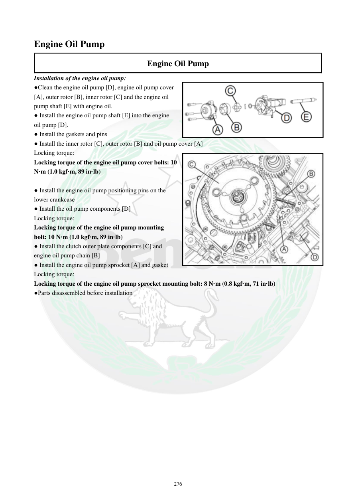

# Manual page 277

> Source: [page-0277.md](../source/page-0277.md)

## Page image / diagram

## Extracted text

# Source page 277

 
276 
Engine Oil Pump  
Engine Oil Pump 
Installation of the engine oil pump: 
●Clean the engine oil pump [D], engine oil pump cover 
[A], outer rotor [B], inner rotor [C] and the engine oil 
pump shaft [E] with engine oil. 
● Install the engine oil pump shaft [E] into the engine 
oil pump [D].  
● Install the gaskets and pins 
● Install the inner rotor [C], outer rotor [B] and oil pump cover [A] 
Locking torque:  
Locking torque of the engine oil pump cover bolts: 10 
N·m (1.0 kgf·m, 89 in·lb) 
 
● Install the engine oil pump positioning pins on the 
lower crankcase 
● Install the oil pump components [D] 
Locking torque:  
Locking torque of the engine oil pump mounting 
bolt: 10 N·m (1.0 kgf·m, 89 in·lb) 
● Install the clutch outer plate components [C] and 
engine oil pump chain [B] 
● Install the engine oil pump sprocket [A] and gasket 
Locking torque:  
Locking torque of the engine oil pump sprocket mounting bolt: 8 N·m (0.8 kgf·m, 71 in·lb)  
●Parts disassembled before installation

## Persian notes

### نصب پمپ روغن موتور
- پمپ روغن **[D]**، کاور **[A]**، روتور خارجی **[B]**، روتور داخلی **[C]** و شفت **[E]** را با روغن موتور تمیز کنید.
- شفت پمپ را داخل پمپ قرار دهید، واشرها و پین‌ها را نصب کنید و سپس روتورها و کاور را ببندید.
- گشتاور پیچ‌های کاور پمپ: **10 N·m = 1.0 kgf·m = 89 in·lb**.
- پین‌های موقعیت‌دهنده را روی کارتل پایینی نصب و مجموعه پمپ را ببندید.
- گشتاور پیچ نصب پمپ: **10 N·m = 1.0 kgf·m = 89 in·lb**.
- مجموعه صفحه بیرونی کلاچ و زنجیر پمپ روغن را نصب کنید.
- چرخ‌دنده پمپ روغن و واشر آن را نصب کنید.
- گشتاور پیچ چرخ‌دنده پمپ روغن: **8 N·m = 0.8 kgf·m = 71 in·lb**.
- در پایان سایر قطعاتی که برای دسترسی باز شده‌اند نصب شوند.
