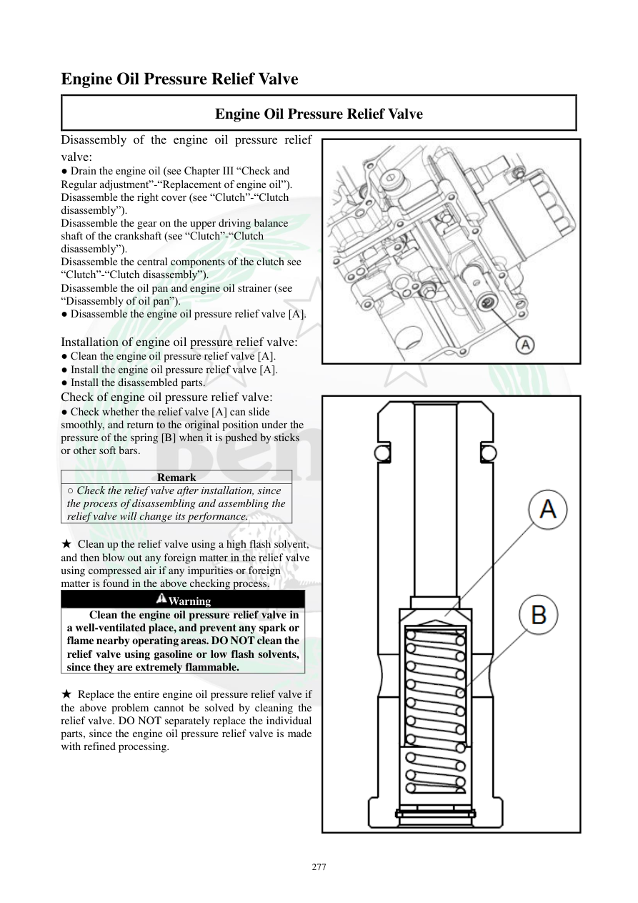

# Manual page 278

> Source: [page-0278.md](../source/page-0278.md)

## Page image / diagram

- [page-0278-img-02.jpeg](../images/embedded/page-0278-img-02.jpeg)

- [page-0278-img-03.png](../images/embedded/page-0278-img-03.png)

## Extracted text

# Source page 278

 
277 
Engine Oil Pressure Relief Valve 
Engine Oil Pressure Relief Valve 
Disassembly of the engine oil pressure relief 
valve: 
● Drain the engine oil (see Chapter III “Check and 
Regular adjustment”-“Replacement of engine oil”). 
Disassemble the right cover (see “Clutch”-“Clutch 
disassembly”). 
Disassemble the gear on the upper driving balance 
shaft of the crankshaft (see “Clutch”-“Clutch 
disassembly”). 
Disassemble the central components of the clutch see 
“Clutch”-“Clutch disassembly”). 
Disassemble the oil pan and engine oil strainer (see 
“Disassembly of oil pan”). 
● Disassemble the engine oil pressure relief valve [A]. 
 
Installation of engine oil pressure relief valve: 
● Clean the engine oil pressure relief valve [A]. 
● Install the engine oil pressure relief valve [A]. 
● Install the disassembled parts. 
Check of engine oil pressure relief valve: 
● Check whether the relief valve [A] can slide 
smoothly, and return to the original position under the 
pressure of the spring [B] when it is pushed by sticks 
or other soft bars. 
 
Remark 
○ Check the relief valve after installation, since 
the process of disassembling and assembling the 
relief valve will change its performance. 
 
★ Clean up the relief valve using a high flash solvent, 
and then blow out any foreign matter in the relief valve 
using compressed air if any impurities or foreign 
matter is found in the above checking process.  
Warning 
Clean the engine oil pressure relief valve in 
a well-ventilated place, and prevent any spark or 
flame nearby operating areas. DO NOT clean the 
relief valve using gasoline or low flash solvents, 
since they are extremely flammable.   
 
★ Replace the entire engine oil pressure relief valve if 
the above problem cannot be solved by cleaning the 
relief valve. DO NOT separately replace the individual 
parts, since the engine oil pressure relief valve is made 
with refined processing.

## Persian notes

### شیر اطمینان فشار روغن
- برای بازکردن، ابتدا روغن تخلیه، کاور راست، چرخ‌دنده بالانسر، اجزای مرکزی کلاچ، کارتل و توری روغن باز می‌شوند و سپس شیر اطمینان **[A]** خارج می‌شود.
- پس از تمیزکاری، شیر باید آزادانه حرکت کند و با فشار فنر **[B]** به موقعیت اولیه برگردد.
- پس از مونتاژ نیز عملکرد آن بررسی شود، چون باز و بست می‌تواند عملکرد شیر را تغییر دهد.
- برای تمیزکاری از حلال با نقطه اشتعال بالا و در محیط دارای تهویه استفاده شود؛ **بنزین یا حلال‌های کم‌نقطه‌اشتعال ممنوع است**.
- اگر مشکل با تمیزکاری رفع نشد، کل مجموعه شیر اطمینان تعویض شود و قطعات داخلی آن جداگانه تعویض نشوند.
