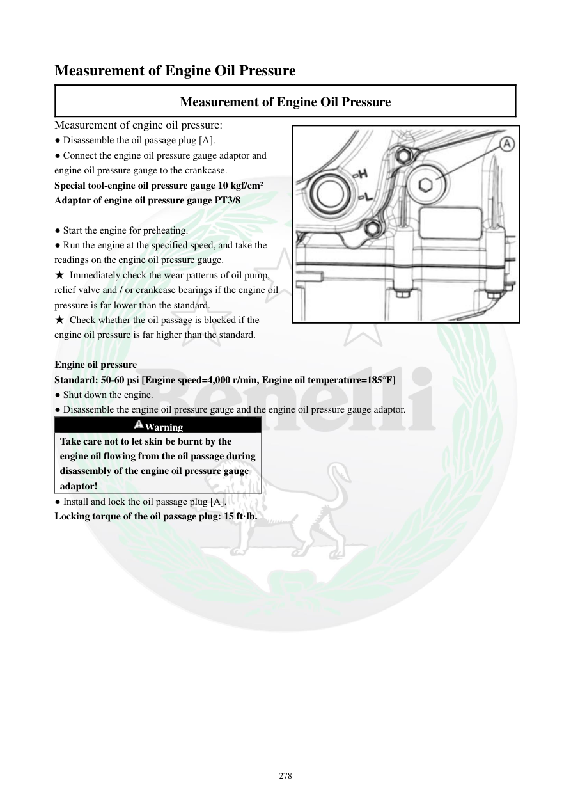

# Manual page 279

> Source: [page-0279.md](../source/page-0279.md)

## Page image / diagram

- [page-0279-img-02.jpeg](../images/embedded/page-0279-img-02.jpeg)

## Extracted text

# Source page 279

 
278 
Measurement of Engine Oil Pressure 
Measurement of Engine Oil Pressure 
Measurement of engine oil pressure: 
● Disassemble the oil passage plug [A]. 
● Connect the engine oil pressure gauge adaptor and 
engine oil pressure gauge to the crankcase. 
Special tool-engine oil pressure gauge 10 kgf/cm² 
Adaptor of engine oil pressure gauge PT3/8 
 
● Start the engine for preheating.  
● Run the engine at the specified speed, and take the 
readings on the engine oil pressure gauge. 
★ Immediately check the wear patterns of oil pump, 
relief valve and / or crankcase bearings if the engine oil 
pressure is far lower than the standard. 
★ Check whether the oil passage is blocked if the 
engine oil pressure is far higher than the standard.  
 
Engine oil pressure 
Standard: 50-60 psi [Engine speed=4,000 r/min, Engine oil temperature=185°F] 
● Shut down the engine. 
● Disassemble the engine oil pressure gauge and the engine oil pressure gauge adaptor. 
Warning 
Take care not to let skin be burnt by the 
engine oil flowing from the oil passage during 
disassembly of the engine oil pressure gauge 
adaptor! 
● Install and lock the oil passage plug [A]. 
Locking torque of the oil passage plug: 15 ft·lb.

## Persian notes

<!-- Persian translation/explanation will be added here. -->
