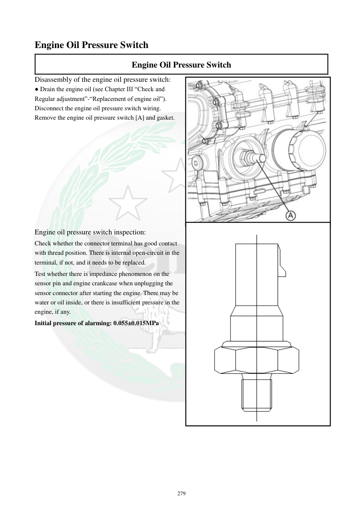

# Manual page 280

> Source: [page-0280.md](../source/page-0280.md)

## Page image / diagram

- [page-0280-img-01.jpeg](../images/embedded/page-0280-img-01.jpeg)

- [page-0280-img-02.png](../images/embedded/page-0280-img-02.png)

## Extracted text

# Source page 280

 
279 
Engine Oil Pressure Switch 
Engine Oil Pressure Switch 
Disassembly of the engine oil pressure switch: 
● Drain the engine oil (see Chapter III “Check and 
Regular adjustment”-“Replacement of engine oil”). 
Disconnect the engine oil pressure switch wiring. 
Remove the engine oil pressure switch [A] and gasket. 
 
 
 
 
 
 
 
 
 
 
 
Engine oil pressure switch inspection: 
Check whether the connector terminal has good contact 
with thread position. There is internal open-circuit in the 
terminal, if not, and it needs to be replaced. 
Test whether there is impedance phenomenon on the 
sensor pin and engine crankcase when unplugging the 
sensor connector after starting the engine. There may be 
water or oil inside, or there is insufficient pressure in the 
engine, if any.   
Initial pressure of alarming: 0.055±0.015MPa

## Persian notes

<!-- Persian translation/explanation will be added here. -->
