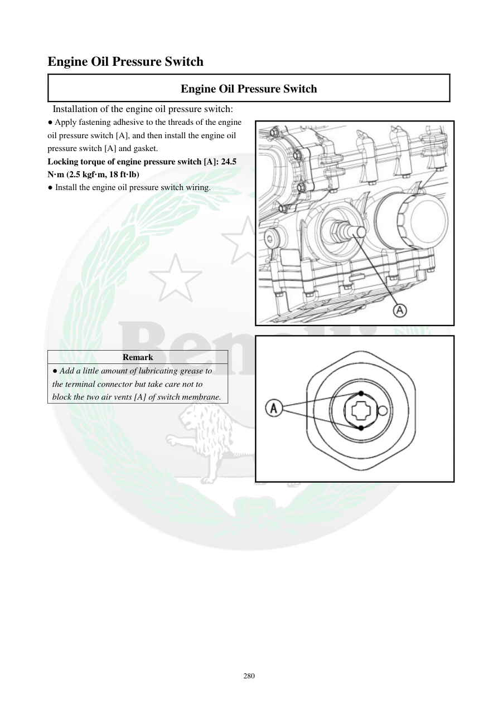

# Manual page 281

> Source: [page-0281.md](../source/page-0281.md)

## Page image / diagram

- [page-0281-img-02.png](../images/embedded/page-0281-img-02.png)

## Extracted text

# Source page 281

 
280 
Engine Oil Pressure Switch 
Engine Oil Pressure Switch 
 Installation of the engine oil pressure switch: 
● Apply fastening adhesive to the threads of the engine 
oil pressure switch [A], and then install the engine oil 
pressure switch [A] and gasket. 
Locking torque of engine pressure switch [A]: 24.5 
N·m (2.5 kgf·m, 18 ft·lb) 
● Install the engine oil pressure switch wiring. 
 
 
 
 
 
 
 
 
 
 
 
 
Remark 
● Add a little amount of lubricating grease to 
the terminal connector but take care not to 
block the two air vents [A] of switch membrane.

## Persian notes

### نصب سوئیچ فشار روغن
- روی رزوه سوئیچ فشار روغن **[A]** چسب قفل‌کننده رزوه اعمال کنید.
- سوئیچ و واشر را نصب کنید.
- گشتاور سوئیچ فشار روغن: **24.5 N·m = 2.5 kgf·m = 18 ft·lb**.
- سیم سوئیچ را وصل کنید.
- مقدار کمی گریس روان‌کننده روی کانکتور قابل استفاده است، اما **دو منفذ تهویه [A] روی دیافراگم سوئیچ نباید مسدود شوند**.
