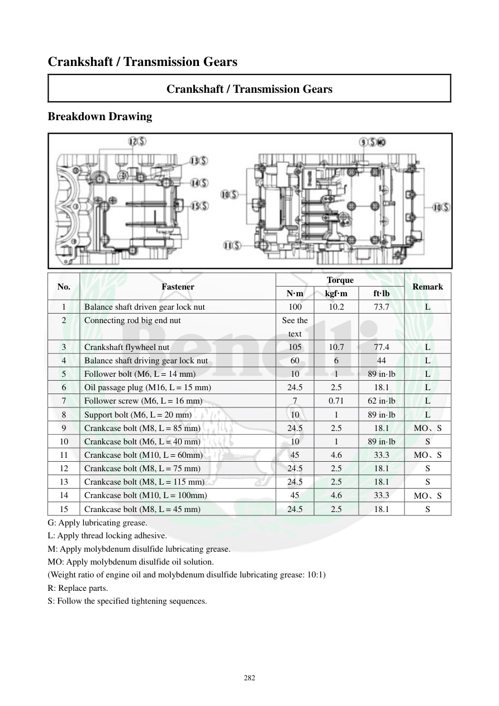

# Manual page 283

> Source: [page-0283.md](../source/page-0283.md)

## Page image / diagram

- [page-0283-img-01.jpeg](../images/embedded/page-0283-img-01.jpeg)

## Extracted text

# Source page 283

 
282 
Crankshaft / Transmission Gears 
Crankshaft / Transmission Gears 
Breakdown Drawing 
 
No. 
Fastener 
Torque 
Remark 
N·m 
kgf·m 
ft·lb 
1 
Balance shaft driven gear lock nut 
100 
10.2 
73.7 
L 
2 
Connecting rod big end nut 
See the 
text 
 
 
 
3 
Crankshaft flywheel nut 
105 
10.7 
77.4 
L 
4 
Balance shaft driving gear lock nut 
60 
6 
44 
L 
5 
Follower bolt (M6, L = 14 mm) 
10 
1 
89 in·lb 
L 
6 
Oil passage plug (M16, L = 15 mm) 
24.5 
2.5 
18.1 
L 
7 
Follower screw (M6, L = 16 mm) 
7 
0.71 
62 in·lb 
L 
8 
Support bolt (M6, L = 20 mm) 
10 
1 
89 in·lb 
L 
9 
Crankcase bolt (M8, L = 85 mm) 
24.5 
2.5 
18.1 
MO、S 
10 
Crankcase bolt (M6, L = 40 mm) 
10 
1 
89 in·lb 
S 
11 
Crankcase bolt (M10, L = 60mm) 
45 
4.6 
33.3 
MO、S 
12 
Crankcase bolt (M8, L = 75 mm) 
24.5 
2.5 
18.1 
S 
13 
Crankcase bolt (M8, L = 115 mm) 
24.5 
2.5 
18.1 
S 
14 
Crankcase bolt (M10, L = 100mm) 
45 
4.6 
33.3 
MO、S 
15 
Crankcase bolt (M8, L = 45 mm) 
24.5 
2.5 
18.1 
S 
G: Apply lubricating grease. 
L: Apply thread locking adhesive. 
M: Apply molybdenum disulfide lubricating grease. 
MO: Apply molybdenum disulfide oil solution. 
(Weight ratio of engine oil and molybdenum disulfide lubricating grease: 10:1) 
R: Replace parts. 
S: Follow the specified tightening sequences.

## Persian notes

### جدول گشتاور میل‌لنگ و چرخ‌دنده‌های انتقال
- مهره قفل چرخ‌دنده متحرک بالانسر: **100 N·m = 10.2 kgf·m = 73.7 ft·lb**، با چسب رزوه.
- مهره انتهای بزرگ شاتون: مقدار گشتاور در متن این صفحه به بخش دیگری ارجاع شده و اینجا عددی درج نشده است؛ **نباید حدس زده شود**.
- مهره فلایویل میل‌لنگ: **105 N·m = 10.7 kgf·m = 77.4 ft·lb**، با چسب رزوه.
- مهره قفل چرخ‌دنده محرک بالانسر: **60 N·m = 6 kgf·m = 44 ft·lb**، با چسب رزوه.
- پیچ follower M6×14: **10 N·m = 1 kgf·m = 89 in·lb**، چسب رزوه.
- پیچ مسیر روغن M16×15: **24.5 N·m = 2.5 kgf·m = 18.1 ft·lb**، چسب رزوه.
- پیچ follower M6×16: **7 N·m = 0.71 kgf·m = 62 in·lb**، چسب رزوه.
- پیچ ساپورت M6×20: **10 N·m = 1 kgf·m = 89 in·lb**، چسب رزوه.
- پیچ‌های کارتل با ابعاد مختلف M8/M10 طبق جدول بین **24.5 و 45 N·m** هستند و بعضی نیازمند ترکیب **MO + S** می‌باشند.
- **MO** یعنی محلول روغن + گریس مولیبدن دی‌سولفید با نسبت وزنی **10:1**؛ **S** یعنی ترتیب سفت‌کردن مشخص دفترچه رعایت شود.
